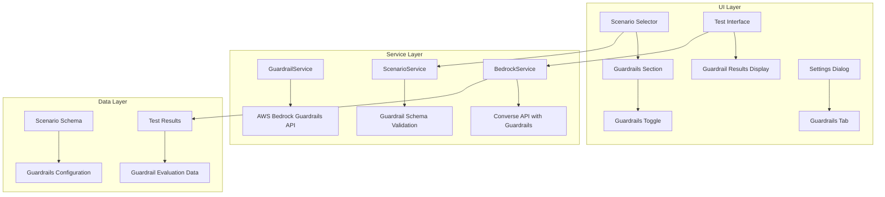
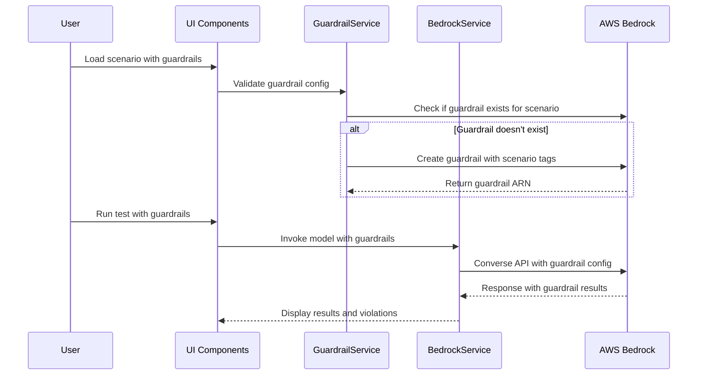

# Design Document

## Overview

The Bedrock Guardrails integration extends the existing Bedrock LLM Analyzer with comprehensive content filtering and safety controls. This design leverages AWS Bedrock Guardrails to provide automated content policy enforcement, PII detection, and harmful content filtering. The integration follows the established architectural patterns in the application, including service-based AWS integration, component-driven UI, and scenario-based configuration management.

The design implements guardrails at multiple levels: scenario configuration, test execution, and result display. It maintains backward compatibility with existing scenarios while providing new capabilities for content safety and compliance.

## Architecture

### High-Level Architecture



### Service Integration Pattern

The guardrails functionality integrates with existing services following the established singleton pattern:

- **GuardrailService**: New service for AWS Bedrock Guardrails API integration
- **BedrockService**: Extended to support guardrails in Converse API calls
- **ScenarioService**: Extended to validate and manage guardrail configurations

### Data Flow Architecture



## Components and Interfaces

### Core Components

#### GuardrailsSection Component
```javascript
// Location: src/components/GuardrailsSection.jsx
const GuardrailsSection = ({
  guardrails,
  isEnabled,
  onToggleEnabled,
  isCollapsed,
  onToggleCollapse,
  validationErrors
}) => {
  // Displays guardrail configuration
  // Shows enable/disable toggle
  // Shows guardrail status and counts
  // Displays validation errors
}
```

#### GuardrailResults Component
```javascript
// Location: src/components/GuardrailResults.jsx
const GuardrailResults = ({
  results,
  onDismiss
}) => {
  // Displays guardrail evaluation results
  // Shows violations with detailed explanations
  // Provides expandable sections for each guardrail
  // Uses consistent theme colors for status indicators
}
```

### Service Interfaces

#### GuardrailService Interface
```javascript
// Location: src/services/guardrailService.js
export class GuardrailService {
  // Core initialization
  async initialize()
  isReady()

  // Guardrail lifecycle management
  async createGuardrailForScenario(scenarioName, guardrailConfig)
  async discoverExistingGuardrails()
  async mapGuardrailsToScenarios(guardrails, scenarios)
  async ensureGuardrailExists(scenarioName, guardrailConfig)

  // Validation operations
  async validateGuardrailConfig(config)

  // Utility methods
  generateGuardrailTags(scenarioName)
  parseGuardrailTags(guardrail)

  // Status and monitoring
  detectCredentialSources()
  getGuardrailStatus(scenarioName)
}
```

#### Extended BedrockService Interface
```javascript
// Extended methods in src/services/bedrockService.js
export class BedrockService {
  // Existing methods...

  // Helper methods for guardrail support
  parseGuardrailResults(response)
  formatGuardrailViolations(violations)
  formatGuardrailConfigForAPI(config)
}
```

### Schema Extensions

#### Scenario Schema Extension
```javascript
// Extended scenario schema in src/utils/scenarioModels.js
const scenarioSchema = {
  // Existing fields...

  guardrails: {
    type: 'object',
    optional: true,
    properties: {
      enabled: { type: 'boolean', default: true },
      name: { type: 'string' }, // Used for AWS guardrail naming and tagging
      description: { type: 'string' },
      blockedInputMessaging: { type: 'string' },
      blockedOutputsMessaging: { type: 'string' },
      contentPolicyConfig: {
        type: 'object',
        properties: {
          filtersConfig: {
            type: 'array',
            items: {
              type: 'object',
              properties: {
                type: { type: 'string', enum: ['SEXUAL', 'VIOLENCE', 'HATE', 'INSULTS', 'MISCONDUCT', 'PROMPT_ATTACK'] },
                inputStrength: { type: 'string', enum: ['NONE', 'LOW', 'MEDIUM', 'HIGH'] },
                outputStrength: { type: 'string', enum: ['NONE', 'LOW', 'MEDIUM', 'HIGH'] }
              }
            }
          }
        }
      },
      wordPolicyConfig: { /* Word filtering configuration */ },
      sensitiveInformationPolicyConfig: { /* PII detection configuration */ },
      topicPolicyConfig: { /* Topic filtering configuration */ },
      // Runtime fields (not stored in scenario file)
      arn: { type: 'string' }, // Set after discovery/creation
      version: { type: 'string', default: 'DRAFT' }
    }
  }
}
```

## Data Models

### Guardrail Configuration Model
```javascript
// Location: src/models/GuardrailConfig.js
export class GuardrailConfig {
  constructor(config, scenarioName) {
    this.scenarioName = scenarioName
    this.name = config.name || `${scenarioName}-guardrail`
    this.description = config.description
    this.blockedInputMessaging = config.blockedInputMessaging
    this.blockedOutputsMessaging = config.blockedOutputsMessaging
    this.contentPolicyConfig = config.contentPolicyConfig
    this.wordPolicyConfig = config.wordPolicyConfig
    this.sensitiveInformationPolicyConfig = config.sensitiveInformationPolicyConfig
    this.topicPolicyConfig = config.topicPolicyConfig

    // Runtime properties
    this.arn = config.arn || null
    this.version = config.version || 'DRAFT'
    this.status = 'pending' // pending, creating, ready, error
  }

  validate() {
    // Validation logic for guardrail configuration
  }

  toAWSCreateFormat() {
    // Convert to AWS CreateGuardrail API format
    return {
      name: this.name,
      description: this.description,
      blockedInputMessaging: this.blockedInputMessaging,
      blockedOutputsMessaging: this.blockedOutputsMessaging,
      contentPolicyConfig: this.contentPolicyConfig,
      wordPolicyConfig: this.wordPolicyConfig,
      sensitiveInformationPolicyConfig: this.sensitiveInformationPolicyConfig,
      topicPolicyConfig: this.topicPolicyConfig,
      tags: [
        { key: 'source', value: 'promptatron' },
        { key: 'scenario', value: this.scenarioName }
      ]
    }
  }

  toConverseFormat() {
    // Convert to AWS Converse API format
    return {
      guardrailIdentifier: this.arn,
      guardrailVersion: this.version
    }
  }

  static fromScenarioConfig(scenarioConfig, scenarioName) {
    return new GuardrailConfig(scenarioConfig.guardrails, scenarioName)
  }

  static fromAWSGuardrail(awsGuardrail) {
    // Create from AWS ListGuardrails response
    const scenarioTag = awsGuardrail.tags?.find(tag => tag.key === 'scenario')
    const scenarioName = scenarioTag?.value || 'unknown'

    return new GuardrailConfig({
      name: awsGuardrail.name,
      description: awsGuardrail.description,
      arn: awsGuardrail.arn,
      version: awsGuardrail.version
    }, scenarioName)
  }
}
```

### Guardrail Evaluation Result Model
```javascript
// Location: src/models/GuardrailResult.js
export class GuardrailResult {
  constructor(result) {
    this.action = result.action // GUARDRAIL_INTERVENED or NONE
    this.output = result.output // Filtered content
    this.assessments = result.assessments || []
    this.timestamp = new Date().toISOString()
    this.guardrailId = result.guardrailId
    this.inputTokens = result.usage?.inputTokens || 0
    this.outputTokens = result.usage?.outputTokens || 0
  }

  hasViolations() {
    return this.action === 'GUARDRAIL_INTERVENED'
  }

  getViolationSummary() {
    // Extract violation details from assessments
  }

  getFilteredContent() {
    return this.output
  }
}
```

## Schema Translation Architecture

### Simplified Schema Format

The system supports a simplified, user-friendly schema format that abstracts away the complexity of the AWS CreateGuardrailCommand structure. This simplified format focuses on common use cases and provides sensible defaults.

#### Simplified Schema Structure
```javascript
// Example simplified guardrail configuration
{
  "topicPolicy": {
    "definition": "Any content not directly related to shipment status, routing, delays, damage, customs, delivery exceptions, or structured JSON outputs for logistics triage.",
    "examples": [
      "What's your favorite movie?",
      "Plan my vacation to Italy.",
      "Write a Python script.",
      "Give me legal advice.",
      "How do I invest $10,000?"
    ]
  },
  "contentPolicy": {
    "filters": ["PROMPT_ATTACK", "INSULTS", "MISCONDUCT"],
    "input": {
      "strength": "HIGH",
      "action": "BLOCK"
    },
    "output": {
      "strength": "LOW",
      "action": "NONE"
    }
  },
  "wordPolicy": {
    "managedLists": ["PROFANITY"],
    "input": {
      "action": "BLOCK"
    }
  },
  "sensitiveInformationPolicy": {
    "pii": ["EMAIL", "NAME", "PHONE", "ADDRESS", "AWS_ACCESS_KEY", "AWS_SECRET_KEY", "PASSWORD", "CREDIT_DEBIT_CARD_NUMBER"],
    "regexes": [
      {
        "name": "BearerToken",
        "pattern": "(?i)bearer\\s+[A-Za-z0-9._\\-]{20,}"
      }
    ],
    "input": {
      "action": "BLOCK"
    },
    "output": {
      "action": "ANONYMIZE"
    }
  },
  "contextualGroundingPolicy": {
    "groundingThreshold": 0.75,
    "relevanceThreshold": 0.70
  },
  "blockedMessages": {
    "input": "Input blocked by logistics policy. Remove PII or unrelated topics.",
    "output": "Output blocked by logistics policy. Keep response factual, relevant, and logistics-focused."
  }
}
```

### Schema Translation Service

#### GuardrailSchemaTranslator Class
```javascript
// Location: src/services/guardrailSchemaTranslator.js
export class GuardrailSchemaTranslator {

  /**
   * Translates simplified schema to AWS CreateGuardrailCommand format
   */
  static translateToAWSFormat(simplifiedConfig, scenarioName) {
    const awsConfig = {
      name: `$Name}-guardrail`,
      description: simplifiedConfig.description || `Guardrail for ${scenarioName} scenario`,
      tags: [
        { key: 'source', value: 'promptatron' },
        { key: 'scenario', value: scenarioName }
      ]
    }

    // Add blocked messaging
    if (simplifiedConfig.blockedMessages) {
      awsConfig.blockedInputMessaging = simplifiedConfig.blockedMessages.input
      awsConfig.blockedOutputsMessaging = simplifiedConfig.blockedMessages.output
    }

    // Translate topic policy
    if (simplifiedConfig.topicPolicy) {
      awsConfig.topicPolicyConfig = this.translateTopicPolicy(simplifiedConfig.topicPolicy)
    }

    // Translate content policy
    if (simplifiedConfig.contentPolicy) {
      awsConfig.contentPolicyConfig = this.translateContentPolicy(simplifiedConfig.contentPolicy)
    }

    // Translate word policy
    if (simplifiedConfig.wordPolicy) {
      awsConfig.wordPolicyConfig = this.translateWordPolicy(simplifiedConfig.wordPolicy)
    }

    // Translate sensitive information policy
    if (simplifiedConfig.sensitiveInformationPolicy) {
      awsConfig.sensitiveInformationPolicyConfig = this.translateSensitiveInformationPolicy(
        simplifiedConfig.sensitiveInformationPolicy
      )
    }

    // Translate contextual grounding policy
    if (simplifiedConfig.contextualGroundingPolicy) {
      awsConfig.contextualGroundingPolicyConfig = this.translateContextualGroundingPolicy(
        simplifiedConfig.contextualGroundingPolicy
      )
    }

    return awsConfig
  }

  /**
   * Translates topic policy to AWS format
   */
  static translateTopicPolicy(topicPolicy) {
    return {
      topicsConfig: [
        {
          name: 'restricted-topics',
          definition: topicPolicy.definition,
          examples: topicPolicy.examples || [],
          type: 'DENY',
          inputAction: 'BLOCK',
          outputAction: 'BLOCK',
          inputEnabled: true,
          outputEnabled: true
        }
      ],
      tierConfig: {
        tierName: 'STANDARD'
      }
    }
  }

  /**
   * Translates content policy to AWS format
   */
  static translateContentPolicy(contentPolicy) {
    const filtersConfig = contentPolicy.filters.map(filterType => {
      const inputConfig = contentPolicy.input || {}
      const outputConfig = contentPolicy.output || {}

      return {
        type: filterType,
        inputStrength: inputConfig.strength || 'HIGH',
        outputStrength: outputConfig.strength || 'LOW',
        inputModalities: ['TEXT'],
        outputModalities: ['TEXT'],
        inputAction: inputConfig.action || 'BLOCK',
        outputAction: outputConfig.action || 'NONE',
        inputEnabled: true,
        outputEnabled: true
      }
    })

    return {
      filtersConfig,
      tierConfig: {
        tierName: 'STANDARD'
      }
    }
  }

  /**
   * Translates word policy to AWS format
   */
  static translateWordPolicy(wordPolicy) {
    const config = {}

    // Handle managed word lists
    if (wordPolicy.managedLists) {
      config.managedWordListsConfig = wordPolicy.managedLists.map(listType => ({
        type: listType,
        inputAction: wordPolicy.input?.action || 'BLOCK',
        outputAction: wordPolicy.output?.action || 'NONE',
        inputEnabled: true,
        outputEnabled: true
      }))
    }

    // Handle custom words
    if (wordPolicy.words) {
      config.wordsConfig = wordPolicy.words.map(word => ({
        text: word,
        inputAction: wordPolicy.input?.action || 'BLOCK',
        outputAction: wordPolicy.output?.action || 'NONE',
        inputEnabled: true,
        outputEnabled: true
      }))
    }

    return config
  }

  /**
   * Translates sensitive information policy to AWS format
   */
  static translateSensitiveInformationPolicy(sensitiveInfoPolicy) {
    const config = {}

    // Handle PII entities
    if (sensitiveInfoPolicy.pii) {
      config.piiEntitiesConfig = sensitiveInfoPolicy.pii.map(piiType => ({
        type: piiType,
        action: 'NONE', // Default to NONE, rely on input/output actions
        inputAction: sensitiveInfoPolicy.input?.action || 'BLOCK',
        outputAction: sensitiveInfoPolicy.output?.action || 'ANONYMIZE',
        inputEnabled: true,
        outputEnabled: true
      }))
    }

    // Handle regex patterns
    if (sensitiveInfoPolicy.regexes) {
      config.regexesConfig = sensitiveInfoPolicy.regexes.map(regex => ({
        name: regex.name,
        description: regex.description || `Custom pattern: ${regex.name}`,
        pattern: regex.pattern,
        action: 'NONE', // Default to NONE, rely on input/output actions
        inputAction: sensitiveInfoPolicy.input?.action || 'BLOCK',
        outputAction: sensitiveInfoPolicy.output?.action || 'ANONYMIZE',
        inputEnabled: true,
        outputEnabled: true
      }))
    }

    return config
  }

  /**
   * Translates contextual grounding policy to AWS format
   */
  static translateContextualGroundingPolicy(groundingPolicy) {
    const filtersConfig = []

    // Add grounding filter if threshold specified
    if (groundingPolicy.groundingThreshold !== undefined) {
      filtersConfig.push({
        type: 'GROUNDING',
        threshold: groundingPolicy.groundingThreshold,
        action: 'BLOCK',
        enabled: true
      })
    }

    // Add relevance filter if threshold specified
    if (groundingPolicy.relevanceThreshold !== undefined) {
      filtersConfig.push({
        type: 'RELEVANCE',
        threshold: groundingPolicy.relevanceThreshold,
        action: 'BLOCK',
        enabled: true
      })
    }

    return {
      filtersConfig
    }
  }

  /**
   * Validates simplified schema structure
   */
  static validateSimplifiedSchema(config) {
    const errors = []

    // Validate topic policy
    if (config.topicPolicy) {
      if (!config.topicPolicy.definition) {
        errors.push('topicPolicy.definition is required')
      }
    }

    // Validate content policy
    if (config.contentPolicy) {
      if (!Array.isArray(config.contentPolicy.filters)) {
        errors.push('contentPolicy.filters must be an array')
      } else {
        const validFilters = ['SEXUAL', 'VIOLENCE', 'HATE', 'INSULTS', 'MISCONDUCT', 'PROMPT_ATTACK']
        config.contentPolicy.filters.forEach(filter => {
          if (!validFilters.includes(filter)) {
            errors.push(`Invalid content filter: ${filter}`)
          }
        })
      }
    }

    // Validate word policy
    if (config.wordPolicy) {
      if (config.wordPolicy.managedLists) {
        const validManagedLists = ['PROFANITY']
        config.wordPolicy.managedLists.forEach(list => {
          if (!validManagedLists.includes(list)) {
            errors.push(`Invalid managed word list: ${list}`)
          }
        })
      }
    }

    // Validate sensitive information policy
    if (config.sensitiveInformationPolicy) {
      if (config.sensitiveInformationPolicy.pii) {
        const validPiiTypes = [
          'ADDRESS', 'AGE', 'AWS_ACCESS_KEY', 'AWS_SECRET_KEY', 'CA_HEALTH_NUMBER',
          'CA_SOCIAL_INSURANCE_NUMBER', 'CREDIT_DEBIT_CARD_CVV', 'CREDIT_DEBIT_CARD_EXPIRY',
          'CREDIT_DEBIT_CARD_NUMBER', 'DRIVER_ID', 'EMAIL', 'INTERNATIONAL_BANK_ACCOUNT_NUMBER',
          'IP_ADDRESS', 'LICENSE_PLATE', 'MAC_ADDRESS', 'NAME', 'PASSWORD', 'PHONE', 'PIN',
          'SWIFT_CODE', 'UK_NATIONAL_HEALTH_SERVICE_NUMBER', 'UK_NATIONAL_INSURANCE_NUMBER',
          'UK_UNIQUE_TAXPAYER_REFERENCE_NUMBER', 'URL', 'USERNAME', 'US_BANK_ACCOUNT_NUMBER',
          'US_BANK_ROUTING_NUMBER', 'US_INDIVIDUAL_TAX_IDENTIFICATION_NUMBER',
          'US_PASSPORT_NUMBER', 'US_SOCIAL_SECURITY_NUMBER', 'VEHICLE_IDENTIFICATION_NUMBER'
        ]

        config.sensitiveInformationPolicy.pii.forEach(piiType => {
          if (!validPiiTypes.includes(piiType)) {
            errors.push(`Invalid PII type: ${piiType}`)
          }
        })
      }

      if (config.sensitiveInformationPolicy.regexes) {
        config.sensitiveInformationPolicy.regexes.forEach(regex => {
          if (!regex.name || !regex.pattern) {
            errors.push('Regex configurations must have name and pattern properties')
          }
        })
      }
    }

    // Validate contextual grounding policy
    if (config.contextualGroundingPolicy) {
      if (config.contextualGroundingPolicy.groundingThreshold !== undefined) {
        const threshold = config.contextualGroundingPolicy.groundingThreshold
        if (threshold < 0 || threshold > 1) {
          errors.push('groundingThreshold must be between 0 and 1')
        }
      }

      if (config.contextualGroundingPolicy.relevanceThreshold !== undefined) {
        const threshold = config.contextualGroundingPolicy.relevanceThreshold
        if (threshold < 0 || threshold > 1) {
          errors.push('relevanceThreshold must be between 0 and 1')
        }
      }
    }

    return {
      isValid: errors.length === 0,
      errors
    }
  }
}
```

### Integration with GuardrailConfig

The `GuardrailConfig` class is extended to support both simplified and AWS formats:

```javascript
// Extended GuardrailConfig class
export class GuardrailConfig {
  constructor(config, scenarioName) {
    this.scenarioName = scenarioName

    // Detect if this is simplified format and translate if needed
    if (this.isSimplifiedFormat(config)) {
      const translatedConfig = GuardrailSchemaTranslator.translateToAWSFormat(config, scenarioName)
      this.initializeFromAWSFormat(translatedConfig)
      this.originalSimplifiedConfig = config // Store original for reference
    } else {
      this.initializeFromAWSFormat(config)
    }
  }

  isSimplifiedFormat(config) {
    // Check for simplified format indicators
    return !!(
      config.topicPolicy ||
      config.contentPolicy ||
      config.wordPolicy ||
      config.sensitiveInformationPolicy ||
      config.contextualGroundingPolicy ||
      config.blockedMessages
    )
  }

  initializeFromAWSFormat(config) {
    this.name = config.name || `${this.scenarioName}-guardrail`
    this.description = config.description
    this.blockedInputMessaging = config.blockedInputMessaging
    this.blockedOutputsMessaging = config.blockedOutputsMessaging
    this.contentPolicyConfig = config.contentPolicyConfig
    this.wordPolicyConfig = config.wordPolicyConfig
    this.sensitiveInformationPolicyConfig = config.sensitiveInformationPolicyConfig
    this.topicPolicyConfig = config.topicPolicyConfig
    this.contextualGroundingPolicyConfig = config.contextualGroundingPolicyConfig

    // Runtime properties
    this.arn = config.arn || null
    this.version = config.version || 'DRAFT'
    this.status = 'pending'
  }

  validate() {
    // If we have original simplified config, validate that first
    if (this.originalSimplifiedConfig) {
      return GuardrailSchemaTranslator.validateSimplifiedSchema(this.originalSimplifiedConfig)
    }

    // Otherwise validate AWS format
    return this.validateAWSFormat()
  }

  static fromSimplifiedConfig(simplifiedConfig, scenarioName) {
    return new GuardrailConfig(simplifiedConfig, scenarioName)
  }
}
```

## Error Handling

### Error Categories and Responses

#### Guardrail Creation Errors
```javascript
const guardrailCreationErrors = {
  'AccessDenied': {
    userMessage: 'AWS credentials lack permission to create guardrails. Please ensure your credentials have bedrock:CreateGuardrail permission.',
    action: 'show_permissions_help',
    recoverable: true
  },
  'ValidationException': {
    userMessage: 'Guardrail configuration is invalid. Please check your scenario configuration.',
    action: 'show_config_help',
    recoverable: true
  },
  'ServiceQuotaExceededException': {
    userMessage: 'You have reached the maximum number of guardrails for your account.',
    action: 'show_quota_help',
    recoverable: false
  },
  'ThrottlingException': {
    userMessage: 'AWS API rate limit exceeded. Retrying automatically...',
    action: 'retry_with_backoff',
    recoverable: true
  }
}
```

#### Guardrail Evaluation Errors
```javascript
const guardrailEvaluationErrors = {
  'ResourceNotFoundException': {
    userMessage: 'Guardrail not found in your AWS account. It may have been deleted.',
    action: 'recreate_guardrail',
    recoverable: true
  },
  'ValidationException': {
    userMessage: 'Invalid content provided for guardrail evaluation.',
    action: 'show_content_requirements',
    recoverable: true
  }
}
```

### Graceful Degradation Strategy

1. **Guardrail Creation Failure**: Continue with model testing without guardrails, show warning
2. **Guardrail Evaluation Failure**: Log error, show warning, continue with model response
3. **AWS Credentials Missing**: Disable guardrail features, show setup guidance
4. **Network Connectivity Issues**: Implement retry with exponential backoff
5. **Service Unavailable**: Cache last known guardrail status, show degraded mode indicator

## Testing Strategy

### Unit Testing Approach

#### GuardrailService Tests
```javascript
// Location: src/services/__tests__/guardrailService.test.js
describe('GuardrailService', () => {
  describe('createGuardrail', () => {
    test('should create guardrail with valid configuration')
    test('should handle AWS API errors gracefully')
    test('should validate configuration before creation')
  })

  describe('applyGuardrail', () => {
    test('should evaluate content against guardrail')
    test('should handle guardrail violations correctly')
    test('should return proper result format')
  })

  describe('ensureGuardrailsExist', () => {
    test('should create missing guardrails')
    test('should reuse existing guardrails')
    test('should handle partial failures')
  })
})
```

#### Component Tests
```javascript
// Location: src/components/__tests__/GuardrailsSection.test.js
describe('GuardrailsSection', () => {
  test('should display guardrail configuration')
  test('should handle enable/disable toggle')
  test('should trigger guardrail-only testing')
  test('should show validation errors')
})
```

### Integration Testing

#### End-to-End Workflow Tests
```javascript
// Location: src/__tests__/integration/guardrails.test.js
describe('Guardrails Integration', () => {
  test('should load scenario with guardrails')
  test('should run model test with guardrails enabled')
  test('should display guardrail results correctly')
})
```

### Manual Testing Scenarios

1. **Scenario Loading**: Load scenarios with various guardrail configurations
2. **AWS Integration**: Test with different AWS credential configurations
3. **Error Handling**: Test with invalid configurations and network issues
4. **UI Interactions**: Test all user interactions and state changes
5. **Performance**: Test with large guardrail configurations and multiple evaluations

### Mock Testing Strategy

#### AWS API Mocking
```javascript
// Location: src/services/__tests__/mocks/guardrailMocks.js
export const mockGuardrailService = {
  createGuardrail: jest.fn(),
  applyGuardrail: jest.fn(),
  deleteGuardrail: jest.fn(),
  listGuardrails: jest.fn()
}
```

#### Test Data
```javascript
// Location: src/__tests__/fixtures/guardrailFixtures.js
export const sampleGuardrailConfig = {
  name: 'test-scenario-guardrail',
  description: 'Test guardrail configuration',
  contentPolicyConfig: {
    filtersConfig: [
      {
        type: 'HATE',
        inputStrength: 'HIGH',
        outputStrength: 'HIGH'
      }
    ]
  }
}

export const sampleAWSGuardrail = {
  arn: 'arn:aws:bedrock:us-east-1:123456789012:guardrail/test-scenario-guardrail',
  version: 'DRAFT',
  name: 'test-scenario-guardrail',
  description: 'Test guardrail configuration',
  tags: [
    { key: 'source', value: 'promptatron' },
    { key: 'scenario', value: 'test-scenario' }
  ]
}
```

## Guardrail Management Architecture

### One Guardrail Per Scenario

The design implements a one-to-one relationship between scenarios and guardrails:

#### 1. Scenario-Level Guardrail Configuration
```javascript
// Each scenario has one guardrail with multiple policy configurations
{
  "guardrails": {
    "enabled": true,
    "name": "fraud-detection-guardrail",
    "description": "Comprehensive guardrail for fraud detection scenario",
    "contentPolicyConfig": {
      "filtersConfig": [
        {
          "type": "HATE",
          "inputStrength": "HIGH",
          "outputStrength": "HIGH"
        }
      ]
    },
    "wordPolicyConfig": {
      "wordsConfig": [
        { "text": "confidential" }
      ]
    },
    "sensitiveInformationPolicyConfig": {
      "piiEntitiesConfig": [
        {
          "type": "CREDIT_DEBIT_CARD_NUMBER",
          "action": "BLOCK"
        }
      ]
    }
  }
}
```

#### 2. AWS Guardrail Creation and Tagging
```javascript
// GuardrailService creates guardrails with proper tagging
async createGuardrailForScenario(scenarioName, guardrailConfig) {
  const createParams = {
    name: `${scenarioName}-guardrail`,
    description: guardrailConfig.description,
    contentPolicyConfig: guardrailConfig.contentPolicyConfig,
    wordPolicyConfig: guardrailConfig.wordPolicyConfig,
    sensitiveInformationPolicyConfig: guardrailConfig.sensitiveInformationPolicyConfig,
    topicPolicyConfig: guardrailConfig.topicPolicyConfig,
    tags: [
      { key: 'source', value: 'promptatron' },
      { key: 'scenario', value: scenarioName }
    ]
  };

  const response = await this.bedrockClient.send(new CreateGuardrailCommand(createParams));
  return response.guardrailArn;
}
```

#### 3. Guardrail Discovery and Mapping
```javascript
// Discover existing guardrails and map to scenarios
async discoverExistingGuardrails() {
  const listResponse = await this.bedrockClient.send(new ListGuardrailsCommand({}));

  const promptatronGuardrails = listResponse.guardrails.filter(guardrail => {
    const sourceTag = guardrail.tags?.find(tag => tag.key === 'source');
    return sourceTag?.value === 'promptatron';
  });

  const guardrailMap = new Map();
  for (const guardrail of promptatronGuardrails) {
    const scenarioTag = guardrail.tags?.find(tag => tag.key === 'scenario');
    if (scenarioTag) {
      guardrailMap.set(scenarioTag.value, guardrail);
    }
  }

  return guardrailMap;
}
```

#### 3. Combined Results Display
```javascript
// GuardrailResults component handles multiple results
const GuardrailResults = ({ results }) => {
  return (
    <div className="guardrail-results">
      {results.map(result => (
        <GuardrailResultItem
          key={result.guardrailId}
          result={result}
          showExpanded={result.hasViolations()}
        />
      ))}
      <GuardrailSummary
        totalGuardrails={results.length}
        violationsCount={results.filter(r => r.hasViolations()).length}
      />
    </div>
  );
};
```

#### 4. AWS Bedrock Integration
The AWS Bedrock Converse API supports multiple guardrails through the `guardrailConfig` parameter:
```javascript
const converseParams = {
  modelId: modelId,
  messages: messages,
  guardrailConfig: {
    guardrailIdentifier: guardrailArn,
    guardrailVersion: "DRAFT" // Can specify multiple via array
  }
};
```

Multiple guardrails are evaluated through the Converse API and results are aggregated for display.

This design provides a comprehensive foundation for implementing AWS Bedrock Guardrails integration while maintaining consistency with the existing application architecture and patterns.
