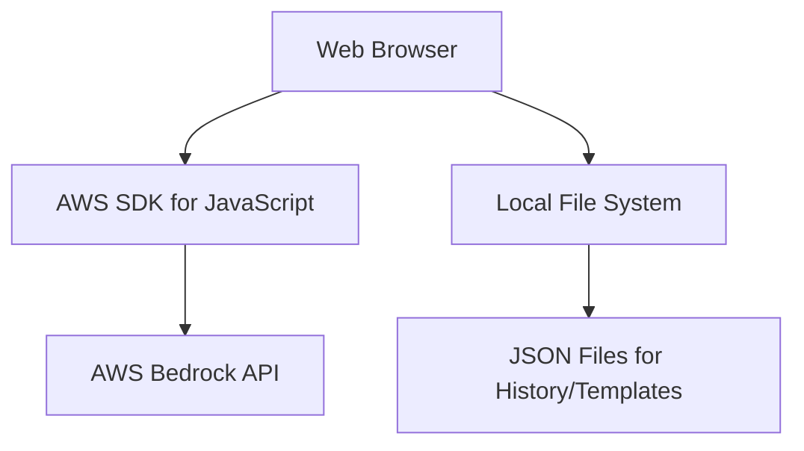

# Design Document

## Overview

The Bedrock LLM Test Harness is a simple browser-based application that provides an intuitive interface for experimenting with AWS Bedrock foundation models. The application runs entirely in the browser using the AWS SDK for JavaScript, with local file storage for persistence.

The system enables users to quickly test different model and prompt combinations, compare results across multiple configurations, save successful templates for reuse, and maintain a history of experiments. All operations are performed client-side with secure local AWS credential integration.

## Architecture

### High-Level Architecture



### Component Overview

- **Frontend**: Single-page web application built with HTML, CSS, and JavaScript
- **AWS SDK**: AWS SDK for JavaScript (v3) for Bedrock integration
- **File Storage**: Local JSON files for history and template persistence
- **Credential Management**: Uses local AWS credentials via browser environment

## Components and Interfaces

### 1. Browser Application

**Technology Stack**: React 19 (latest), Tailwind CSS, JavaScript (ES6+), AWS SDK for JavaScript v3

**Key Components**:
- Model Selection Dropdown
- Dataset Type Selection (dynamically loaded from folders)
- Dataset Option Selection (dynamically loaded from files)
- Prompt Configuration Textarea
- Test Execution Button
- Results Display Area
- History Navigation Panel
- Template Management Interface
- Side-by-side Comparison View

**Features**:
- Direct AWS Bedrock API calls from browser
- Local JSON file storage for persistence
- Beautiful, modern UI with Tailwind CSS styling
- Reactive components with React for smooth interactions
- Responsive design for various screen sizes
- Single-page application with component-based architecture

### 2. AWS Integration

**AWS SDK**: AWS SDK for JavaScript v3 (Bedrock Runtime client)

**Key Operations**:
- `ListFoundationModels` - Get available models
- `InvokeModel` - Execute LLM tests

**Data Structures**:
```javascript
// Test Configuration
const testConfig = {
  modelId: "amazon.nova-pro-v1:0",
  prompt: "You are a helpful assistant. Please analyze the following data:",
  datasetType: "enterprise-fraud",
  datasetOption: "dataset1.json",
  datasetContent: "loaded dataset content"
};

// Test Result
const testResult = {
  id: "uuid-string",
  modelId: "amazon.nova-pro-v1:0",
  prompt: "user-prompt",
  datasetType: "enterprise-fraud",
  datasetOption: "dataset1.json",
  response: "llm-response",
  timestamp: "2025-01-09T10:30:00Z"
};
```

### 3. Local File Storage

**Storage Format**: JSON files for persistence

**File Structure**:
```
bedrock-test-harness/
├── public/
│   └── index.html
├── src/
│   ├── components/
│   │   ├── ModelSelector.jsx
│   │   ├── DatasetSelector.jsx
│   │   ├── PromptEditor.jsx
│   │   ├── TestResults.jsx
│   │   └── History.jsx
│   ├── services/
│   │   ├── bedrockService.js
│   │   └── fileService.js
│   ├── App.jsx
│   └── index.js
├── data/
│   ├── history.json
│   └── templates.json
└── datasets/
    └── enterprise-fraud/
        ├── dataset1.json
        ├── dataset2.json
        └── dataset3.json
```

**Data Files**:
- `history.json`: Array of test results
- `templates.json`: Array of saved templates
- `datasets/`: Directory structure for different use cases and datasets

**Key Functions**:
- `loadHistory()`: Read test history from JSON file
- `saveTest(testResult)`: Append new test to history
- `loadTemplates()`: Read saved templates
- `saveTemplate(template)`: Save new template
- `loadDatasetTypes()`: Scan datasets directory for available use case folders
- `loadDatasetOptions(type)`: Load available datasets for a specific use case
- `loadDataset(type, option)`: Load specific dataset content

### 4. Credential Management

**AWS Credentials**: Uses browser-compatible credential providers

**Supported Methods**:
- AWS CLI credentials (via local file access)
- Environment variables (if running in Node.js environment)
- Temporary credentials from AWS STS

**Implementation**:
- Credential detection on application startup
- Clear error messages for credential issues
- Support for multiple AWS profiles

## File Formats

### History File (history.json)
```json
[
  {
    "id": "uuid-string",
    "modelId": "amazon.nova-pro-v1:0",
    "prompt": "user-prompt",
    "datasetType": "enterprise-fraud",
    "datasetOption": "dataset1.json",
    "response": "llm-response",
    "timestamp": "2025-01-09T10:30:00Z"
  }
]
```

### Templates File (templates.json)
```json
[
  {
    "id": "uuid-string",
    "name": "Template Name",
    "description": "Template description",
    "modelId": "amazon.nova-pro-v1:0",
    "prompt": "template-prompt",
    "datasetType": "enterprise-fraud",
    "datasetOption": "dataset1.json",
    "tags": ["tag1", "tag2"],
    "createdAt": "2025-01-09T10:30:00Z"
  }
]
```

### Dataset Structure
```
datasets/
├── enterprise-fraud/          # Use case folder
│   ├── dataset1.json         # Dataset option 1
│   ├── dataset2.json         # Dataset option 2
│   └── dataset3.json         # Dataset option 3
└── [future-use-case]/        # Additional use cases
    ├── option1.json
    └── option2.json
```

## Implementation Details

### Core JavaScript Modules

**React Component Structure**:
```javascript
// App.jsx - Main application component
import React, { useState, useEffect } from 'react';
import ModelSelector from './components/ModelSelector';
import DatasetSelector from './components/DatasetSelector';
import PromptEditor from './components/PromptEditor';
import TestResults from './components/TestResults';
import History from './components/History';

function App() {
  const [selectedModel, setSelectedModel] = useState('');
  const [selectedDataset, setSelectedDataset] = useState({});
  const [prompt, setPrompt] = useState('');
  const [testResults, setTestResults] = useState(null);
  const [history, setHistory] = useState([]);
  
  // Component logic and AWS integration
  return (
    <div className="min-h-screen bg-gradient-to-br from-blue-50 to-indigo-100">
      {/* React components */}
    </div>
  );
}

// bedrockService.js - AWS integration
import { BedrockRuntimeClient, InvokeModelCommand, ListFoundationModelsCommand } from "@aws-sdk/client-bedrock-runtime";

export class BedrockService {
  constructor() {
    this.client = null;
  }
  
  async initialize() {
    // Initialize AWS client
  }
  
  async listModels() {
    // Get available models
  }
  
  async invokeModel(modelId, prompt, datasetContent) {
    // Execute test
  }
}
```

### File Operations
- Use File System Access API (where supported) or fallback to download/upload
- Automatic file creation if data files don't exist
- Error handling for file access issues

## Error Handling

### AWS Integration Errors
- **Credential Issues**: Clear error messages with setup instructions
- **Model Access**: Handle model access denied with guidance
- **Network Issues**: Graceful error handling with retry options

### File System Errors
- **File Access**: Handle cases where local file access is restricted
- **JSON Parsing**: Graceful handling of corrupted data files
- **Storage Limits**: Manage large history files

### Browser Compatibility
- **CORS Issues**: Instructions for running with local server if needed
- **File API Support**: Fallback options for browsers without File System Access API
- **AWS SDK Compatibility**: Ensure compatibility with modern browsers

## Testing Strategy

### Unit Testing
- **JavaScript Functions**: Jest tests for core application logic
- **File Operations**: Test JSON file read/write operations
- **AWS Integration**: Mock AWS SDK responses for testing

### Manual Testing
- **User Experience**: Test UI flows and responsiveness
- **Error Scenarios**: Test error handling with invalid inputs
- **Browser Compatibility**: Test across different browsers

### Test Data
- Sample prompt templates for different use cases
- Mock AWS Bedrock responses for different models
- Edge case scenarios (empty inputs, malformed JSON, etc.)


## Security Considerations

### AWS Credentials
- Never store AWS credentials in application code
- Use local AWS credential chain (CLI, environment, IAM roles)
- Validate permissions before attempting Bedrock operations

### Data Privacy
- Process all test data locally without external transmission beyond AWS Bedrock API
- Sanitize sensitive information in logs and error messages
- Provide clear data usage disclosure to users
- Allow users to clear history and templates for privacy

### Browser Security
- Input validation and sanitization
- Secure credential handling in browser environment
- Content Security Policy for enhanced security

## Performance Optimization

### Response Time
- Asynchronous processing for long-running LLM requests
- Progress indicators for user feedback during analysis
- Caching of model lists and configuration data

### Resource Management
- Efficient memory usage for large input datasets
- Cleanup of old test data from JSON files
- Template storage optimization
- Browser memory management for large histories

### Scalability
- Modular JavaScript design allows for future enhancements
- JSON schema supports additional metadata fields
- Pagination for large history displays