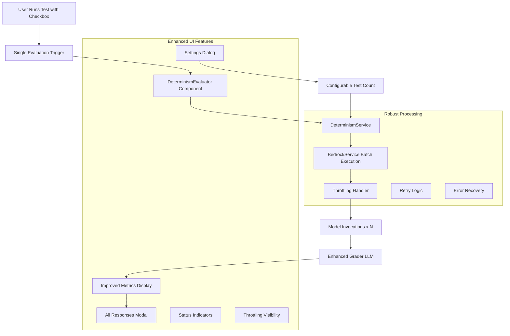
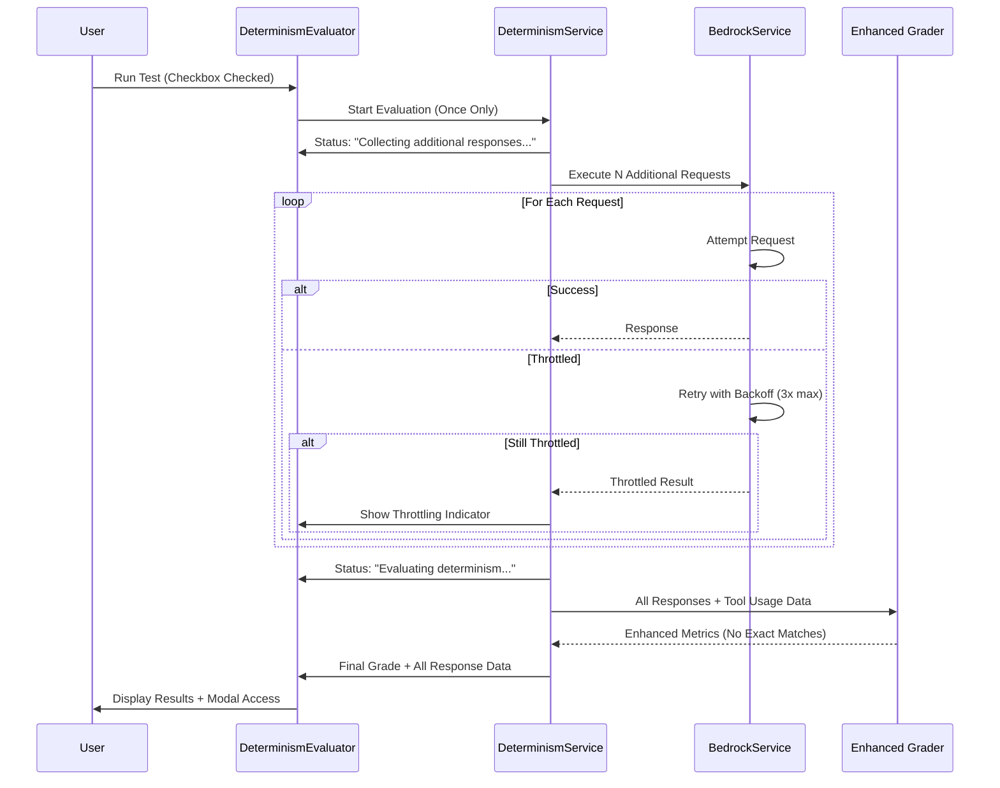

# Design Document

## Overview

The Enhanced Determinism Evaluator provides robust, user-friendly assessment of LLM response consistency. The system executes configurable numbers of identical prompts (default 10 total), handles AWS throttling gracefully, and provides comprehensive feedback through improved UI components. The design emphasizes simplicity, reliability, and clear user communication.

The architecture maintains minimal coupling to existing code while providing enhanced features like settings management, throttling visibility, improved metrics, and comprehensive response viewing.

## Architecture

### High-Level Architecture



### Enhanced Evaluation Flow



## Components and Interfaces

### 1. Enhanced DeterminismEvaluator Component

**Purpose**: Robust React component with improved status display, throttling visibility, and comprehensive results modal.

**Props Interface**:
```typescript
interface DeterminismEvaluatorProps {
  testResult: TestResult
  onEvaluationComplete?: (grade: EnhancedDeterminismGrade) => void
  enabled?: boolean
  settings?: DeterminismSettings
}

interface EnhancedDeterminismGrade {
  grade: 'A' | 'B' | 'C' | 'D' | 'F'
  score: number
  reasoning: string
  metrics: EnhancedMetrics
  allResponses: ResponseWithMetadata[]
  throttledCount: number
  timestamp: string
}

interface EnhancedMetrics {
  semanticSimilarity: number // Excludes exact matches
  decisionConsistency: number
  structureConsistency: number
  toolUsageConsistency?: number
  responseCount: number
  uniqueResponses: number
  exactMatches: number // Tracked but not used in scoring
}

interface ResponseWithMetadata {
  text: string
  toolUsage?: ToolUsageData
  wasThrottled: boolean
  retryCount: number
  timestamp: string
}

interface DeterminismSettings {
  testCount: number // 3-50, default 10
  enableThrottlingAlerts: boolean
  maxRetryAttempts: number
}
```

**Enhanced States**:
- `idle`: No evaluation in progress
- `collecting`: Collecting additional responses (with progress)
- `evaluating`: Analyzing responses for determinism
- `completed`: Evaluation finished with comprehensive results
- `error`: Evaluation failed with recovery options
- `throttled`: Currently handling rate limits

### 2. Enhanced DeterminismService

**Purpose**: Simplified, robust service that manages evaluation lifecycle with improved error handling and throttling management.

**Key Methods**:
```typescript
class DeterminismService {
  // Core evaluation management
  async startEvaluation(testConfig: TestConfiguration): Promise<string>
  async cancelEvaluation(evaluationId: string): Promise<void>
  onStatusUpdate(evaluationId: string, callback: (status: EvaluationStatus) => void): () => void

  // Settings management
  getSettings(): DeterminismSettings
  updateSettings(settings: Partial<DeterminismSettings>): void

  // State management (simplified)
  private activeEvaluations: Map<string, EvaluationState>
  private statusCallbacks: Map<string, Function[]>

  // Throttling and retry logic
  private handleThrottling(error: AWSError, attempt: number): Promise<boolean>
  private shouldRetry(error: AWSError, attempt: number): boolean
  private recordThrottledResult(evaluationId: string, requestIndex: number): void
}
```

**Simplified Architecture**:
- No service worker complexity - runs on main thread
- Direct integration with existing BedrockService
- Minimal state management to avoid race conditions
- Clear error boundaries and recovery paths

### 3. System-Wide Settings Integration

**Purpose**: Integrates determinism settings into a comprehensive application settings system.

**System Settings Architecture**:
```typescript
// Global Settings Dialog Component
interface SettingsDialogProps {
  isOpen: boolean
  onClose: () => void
  onSave: (settings: AppSettings) => void
  currentSettings: AppSettings
}

// Application Settings Structure
interface AppSettings {
  determinism: DeterminismSettings
  ui: UISettings
  aws: AWSSettings
  // Future settings sections...
}

interface DeterminismSettings {
  testCount: number // 3-50, default 10
  enableThrottlingAlerts: boolean
  maxRetryAttempts: number // 1-5, default 3
  showDetailedProgress: boolean
}

// Settings Service (System-Wide)
class SettingsService {
  static save(settings: AppSettings): void
  static load(): AppSettings
  static getDefaults(): AppSettings
  static validateSection<T>(section: keyof AppSettings, data: T): ValidationResult<T>
}
```

**Settings Dialog Sections**:
- **Determinism**: Test count, throttling alerts, retry attempts, progress detail level
- **UI**: Theme preferences, animation settings, default tab behavior
- **AWS**: Region preferences, timeout settings, retry configurations
- **Extensible**: Easy to add new sections as the application grows

**Integration Points**:
- Settings button in main application header/menu
- Quick access from determinism evaluator component
- Keyboard shortcut support (Ctrl/Cmd + ,)
- Settings persist across browser sessions with localStorage

### 4. Enhanced Throttling Management

**Purpose**: Provides visible, responsible handling of AWS rate limits with clear user feedback and robust retry logic.

**Throttling Strategy**:
```typescript
interface ThrottlingHandler {
  // Retry logic with exponential backoff
  async executeWithRetry<T>(
    operation: () => Promise<T>,
    maxAttempts: number,
    baseDelay: number
  ): Promise<T | ThrottledResult>

  // Visual feedback for throttling
  onThrottleDetected(callback: (info: ThrottleInfo) => void): void

  // Abandonment after max attempts
  shouldAbandon(attempt: number, error: AWSError): boolean
}

interface ThrottleInfo {
  attempt: number
  nextRetryIn: number
  totalThrottled: number
  message: string
}

interface ThrottledResult {
  wasThrottled: true
  attempts: number
  finalError: AWSError
  timestamp: string
}
```

**Conservative Approach**:
- Single request at a time (concurrency: 1)
- 2-second delay between requests
- Exponential backoff: 5s, 10s, 20s for retries
- Clear abandonment after 3 failed attempts
- Visual indicators for all throttling events

### 5. Enhanced Grader Integration

**Purpose**: Provides improved analysis focusing on semantic differences while excluding exact matches from similarity calculations.

**Enhanced Grader Prompt**:
```
You are an expert evaluator of LLM response determinism. Analyze the provided responses to evaluate how deterministic the model's behavior is.

IMPORTANT: Focus on semantic and functional consistency rather than exact text matching. Identical responses should be noted but not heavily weighted in similarity calculations.

Enhanced Evaluation Criteria:
- Semantic equivalence (same meaning, different wording)
- Decision consistency (same conclusions/recommendations)
- Structure consistency (similar response format/organization)
- Tool usage consistency (if applicable - same tools used appropriately)
- Functional equivalence (same practical outcomes)

Exclude from similarity scoring:
- Exact text matches (note them separately)
- Minor formatting differences
- Trivial word order changes

Assign grades based on meaningful variation:
- A: Highly deterministic (>90% semantic consistency)
- B: Good determinism (70-90% semantic consistency)
- C: Moderate determinism (50-70% semantic consistency)
- D: Low determinism (30-50% semantic consistency)
- F: Non-deterministic (<30% semantic consistency)

Required JSON response format:
{
  "grade": "A",
  "score": 95,
  "reasoning": "Detailed explanation focusing on semantic consistency",
  "metrics": {
    "semanticSimilarity": 0.94,
    "decisionConsistency": 0.98,
    "structureConsistency": 0.92,
    "toolUsageConsistency": 0.96,
    "responseCount": 10,
    "uniqueResponses": 3,
    "exactMatches": 2
  },
  "notable_variations": [
    "Different phrasing for same recommendation",
    "Varied explanation depth but same conclusion"
  ]
}

Responses to analyze (excluding throttled responses):
```

**Improved Analysis**:
- Separates exact matches from semantic analysis
- Focuses on meaningful variations
- Includes tool usage consistency evaluation
- Provides detailed breakdown of variation types
- Excludes throttled responses from metrics

## Data Models

### TestConfiguration
```typescript
interface TestConfiguration {
  id: string
  modelId: string
  systemPrompt: string
  userPrompt: string
  datasetContent: string
  originalResponse: string
  timestamp: string
}
```

### EvaluationStatus
```typescript
interface EvaluationStatus {
  id: string
  status: 'queued' | 'running' | 'grading' | 'completed' | 'error'
  progress: number // 0-100
  completedRequests: number
  totalRequests: number
  currentPhase: string
  estimatedTimeRemaining?: number
  error?: string
  result?: DeterminismGrade
}
```

### StorageSchema
```typescript
interface DeterminismResult {
  evaluationId: string
  testId: string
  grade: DeterminismGrade
  responses: string[]
  metadata: {
    modelId: string
    evaluationDuration: number
    concurrencyUsed: number
    throttleEvents: number
  }
}
```

## Enhanced Error Handling & User Experience

### Comprehensive Error Management

1. **AWS Throttling (Primary Focus)**
   - Immediate visual feedback: "Handling rate limits..." status
   - Exponential backoff: 5s, 10s, 20s delays
   - Clear abandonment after 3 attempts per request
   - Throttled results tracked but excluded from analysis
   - Progress bar shows throttling impact

2. **Network and Service Failures**
   - Graceful degradation with partial results
   - Clear error messages with suggested actions
   - Original test results remain unaffected
   - Retry options with user control

3. **Grader LLM Issues**
   - Fallback to basic statistical analysis
   - Clear indication of limited analysis mode
   - Preserve all response data for manual review

4. **State Management Errors**
   - Prevent duplicate evaluations with simple flags
   - Clean cancellation of previous evaluations
   - No complex state synchronization issues

### Error Recovery Strategies

```javascript
const ERROR_RECOVERY = {
  throttling: {
    action: 'reduce_concurrency',
    backoff: 'exponential',
    maxRetries: 5
  },
  network: {
    action: 'pause_and_retry',
    retryDelay: 30000,
    maxRetries: 3
  },
  grader_failure: {
    action: 'fallback_analysis',
    simplifiedPrompt: true
  },
  worker_crash: {
    action: 'restart_from_checkpoint',
    preserveState: true
  }
}
```

## UI/UX Enhancements

### Enhanced Status Display

1. **Progress Indicators**
   - Clear phase messaging: "Collecting additional responses..." → "Evaluating determinism..."
   - Progress percentage with completed/total counts
   - Estimated time remaining based on current progress
   - Throttling indicators with retry countdown

2. **Results Modal Improvements**
   - Display all individual responses with timestamps
   - Show tool usage data for each response
   - Highlight throttled responses (grayed out)
   - Expandable sections for detailed analysis
   - Export functionality for response data

3. **System Settings Integration**
   - Global settings dialog accessible from main menu
   - Dedicated determinism section within settings
   - Quick settings access from determinism evaluator
   - Inline validation with immediate feedback
   - Settings persistence across sessions
   - Clear impact explanation (more tests = better accuracy, longer time)

### Simplified Architecture Benefits

1. **Maintainability**
   - No service worker complexity
   - Direct integration with existing services
   - Minimal new abstractions
   - Clear error boundaries

2. **Reliability**
   - Fewer moving parts
   - Predictable execution flow
   - Simple state management
   - Easy debugging and monitoring

### Browser Compatibility Tests

1. **Service Worker Support**
   - Test across Chrome, Firefox, Safari, Edge
   - Fallback behavior for unsupported browsers

2. **IndexedDB Storage**
   - Cross-browser storage consistency
   - Storage quota handling

## Implementation Phases

### Phase 1: Core Infrastructure
- Service worker setup and communication
- Basic DeterminismEvaluator component
- ThroughputManager with default limits

### Phase 2: AWS Integration
- Bedrock service integration
- Rate limit detection and handling
- Error recovery mechanisms

### Phase 3: Grader Integration
- Grader LLM implementation
- Response analysis and scoring
- Grade display and breakdown modal

### Phase 4: Polish and Optimization
- Performance optimization
- Enhanced error messages
- Comprehensive testing

## Security Considerations

1. **Credential Handling**
   - Service worker inherits main thread credentials
   - No additional credential storage required
   - Respect existing AWS credential lifecycle

2. **Data Privacy**
   - All processing happens client-side
   - No data sent to external services except AWS Bedrock
   - Evaluation results stored locally only

3. **Resource Limits**
   - Implement maximum evaluation time (30 minutes)
   - Limit concurrent evaluations (1 per browser tab)
   - Respect browser storage quotas

## Performance Considerations

1. **Memory Management**
   - Stream large responses instead of storing in memory
   - Garbage collect completed evaluations
   - Limit stored evaluation history (last 50 evaluations)

2. **Network Optimization**
   - Reuse HTTP connections where possible
   - Compress request payloads
   - Implement request deduplication for identical prompts

3. **UI Responsiveness**
   - All heavy processing in service worker
   - Throttled UI updates (max 2 per second)
   - Progressive loading of evaluation details

## Monitoring and Analytics

1. **Evaluation Metrics**
   - Success/failure rates
   - Average evaluation duration
   - Concurrency utilization
   - Grade distribution

2. **Performance Metrics**
   - Request latency percentiles
   - Throughput achieved vs. limits
   - Error rates by category

3. **User Experience Metrics**
   - Feature adoption rate
   - Modal interaction patterns
   - Evaluation completion rates
