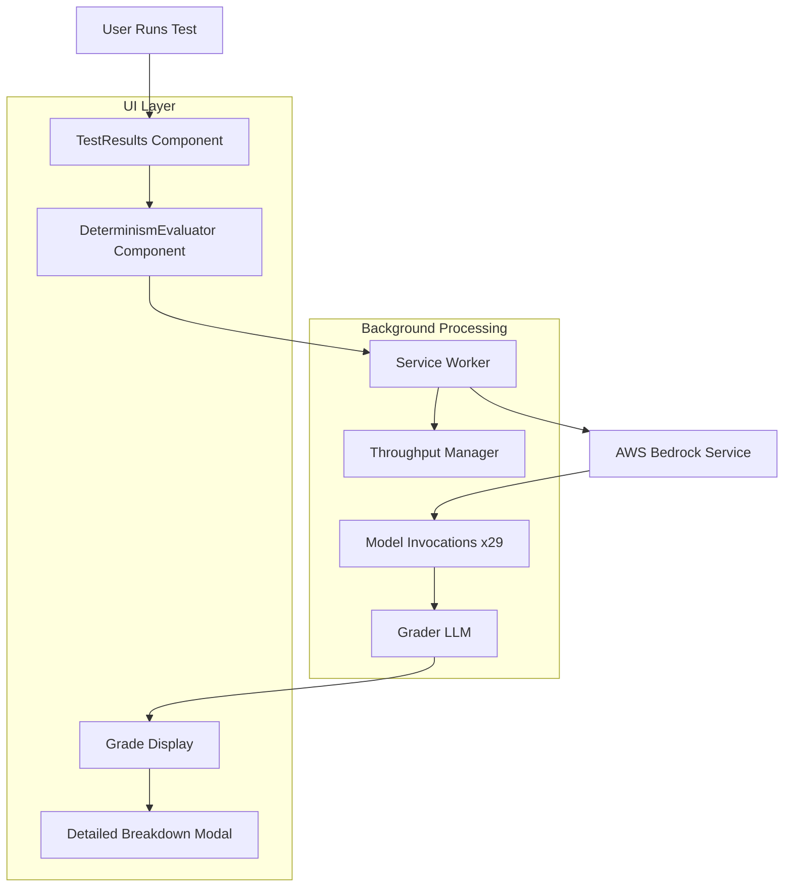
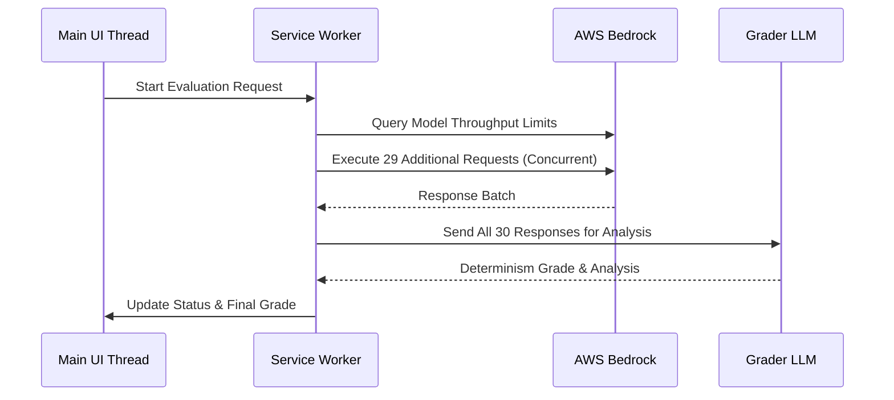

# Design Document

## Overview

The Determinism Evaluator is a non-intrusive feature that automatically assesses the consistency of LLM responses by running the same prompt 30 times and analyzing variance using a grader LLM. The system operates in the background using service workers, respects AWS Bedrock throughput limnd provides visual feedback through an injectable UI component.

The design follows a modular architecture with minimal coupling to the existing codebase, ensuring easy maintenance and the ability to disable the feature without affecting core functionality.

## Architecture

### High-Level Architecture



### Service Worker Architecture



## Components and Interfaces

### 1. DeterminismEvaluator Component

**Purpose**: Injectable React component that displays evaluation status and results within TestResults.

**Props Interface**:
```typescript
interface DeterminismEvaluatorProps {
  testResult: TestResult
  onEvaluationComplete?: (grade: DeterminismGrade) => void
  enabled?: boolean
  graderSystemPrompt?: string
}

interface DeterminismGrade {
  grade: 'A' | 'B' | 'C' | 'D' | 'F'
  score: number
  reasoning: string
  variance: VarianceAnalysis
  timestamp: string
}

interface VarianceAnalysis {
  responseCount: number
  uniqueResponses: number
  averageLength: number
  lengthVariance: number
  semanticSimilarity: number
  actionConsistency: number
}
```

**States**:
- `idle`: No evaluation in progress
- `evaluating`: Background evaluation running
- `completed`: Evaluation finished with grade
- `error`: Evaluation failed

### 2. DeterminismService

**Purpose**: Manages the evaluation lifecycle and communicates with service worker.

**Key Methods**:
```typescript
class DeterminismService {
  async startEvaluation(testConfig: TestConfiguration): Promise<string>
  async getEvaluationStatus(evaluationId: string): Promise<EvaluationStatus>
  async cancelEvaluation(evaluationId: string): Promise<void>
  onStatusUpdate(callback: (status: EvaluationStatus) => void): void
}
```

### 3. Service Worker (determinism-worker.js)

**Purpose**: Handles background processing of multiple model invocations and grading.

**Key Functions**:
- `executeEvaluation(testConfig)`: Main evaluation orchestrator
- `getThroughputLimits(modelId)`: Query AWS for model limits
- `executeConcurrentRequests(requests, concurrencyLimit)`: Batch execution with rate limiting
- `gradeResponses(responses, graderPrompt)`: Send to grader LLM
- `parseGraderResponse(response)`: Extract grade and reasoning

### 4. ThroughputManager

**Purpose**: Manages AWS Bedrock rate limits and concurrent request execution.

**Features**:
- Query AWS Service Quotas API for model-specific limits
- Implement exponential backoff for throttling
- Dynamic concurrency adjustment based on response times
- Conservative defaults when limits cannot be determined

**Default Limits** (when AWS limits unavailable):
```javascript
const DEFAULT_LIMITS = {
  'anthropic.claude-3-5-sonnet': { requestsPerMinute: 50, tokensPerMinute: 40000 },
  'anthropic.claude-3-haiku': { requestsPerMinute: 100, tokensPerMinute: 25000 },
  'amazon.nova-pro': { requestsPerMinute: 30, tokensPerMinute: 30000 },
  'meta.llama3-1-70b': { requestsPerMinute: 20, tokensPerMinute: 20000 },
  default: { requestsPerMinute: 10, tokensPerMinute: 10000 }
}
```

### 5. GraderLLM Integration

**Purpose**: Analyzes response variance and assigns determinism grades.

**Grader System Prompt Template**:
```
You are an expert evaluator of LLM response determinism. Analyze the following 30 responses to the same prompt and evaluate how deterministic the model's behavior is.

Evaluation Criteria:
- Response consistency (identical or near-identical responses)
- Length variance (similar response lengths)
- Semantic similarity (same meaning, different wording)
- Action consistency (same recommended actions/conclusions)
- Format consistency (same output structure)

Assign a letter grade (A-F) where:
- A: Highly deterministic (>90% consistency)
- B: Good determinism (70-90% consistency)
- C: Moderate determinism (50-70% consistency)
- D: Low determinism (30-50% consistency)
- F: Non-deterministic (<30% consistency)

Provide your analysis in this JSON format:
{
  "grade": "A",
  "score": 95,
  "reasoning": "Detailed explanation of the grade",
  "variance": {
    "responseCount": 30,
    "uniqueResponses": 3,
    "averageLength": 245,
    "lengthVariance": 12.5,
    "semanticSimilarity": 0.94,
    "actionConsistency": 0.98
  }
}

[PLACEHOLDER_FOR_USER_GRADER_PROMPT]

Responses to analyze:
```

## Data Models

### TestConfiguration
```typescript
interface TestConfiguration {
  id: string
  modelId: string
  systemPrompt: string
  userPrompt: string
  datasetContent: string
  originalResponse: string
  timestamp: string
}
```

### EvaluationStatus
```typescript
interface EvaluationStatus {
  id: string
  status: 'queued' | 'running' | 'grading' | 'completed' | 'error'
  progress: number // 0-100
  completedRequests: number
  totalRequests: number
  currentPhase: string
  estimatedTimeRemaining?: number
  error?: string
  result?: DeterminismGrade
}
```

### StorageSchema
```typescript
interface DeterminismResult {
  evaluationId: string
  testId: string
  grade: DeterminismGrade
  responses: string[]
  metadata: {
    modelId: string
    evaluationDuration: number
    concurrencyUsed: number
    throttleEvents: number
  }
}
```

## Error Handling

### Error Categories and Responses

1. **AWS Rate Limiting**
   - Implement exponential backoff (1s, 2s, 4s, 8s, 16s)
   - Reduce concurrency automatically
   - Display "Evaluation slowed due to rate limits" message

2. **Network Failures**
   - Retry individual requests up to 3 times
   - Pause evaluation if >50% of requests fail
   - Resume when connectivity restored

3. **Grader LLM Failures**
   - Retry grading with simplified prompt
   - Fallback to basic statistical analysis if grader unavailable
   - Display "Evaluation completed with limited analysis" message

4. **Service Worker Crashes**
   - Detect worker termination
   - Restart evaluation from last checkpoint
   - Preserve partial results in IndexedDB

### Error Recovery Strategies

```javascript
const ERROR_RECOVERY = {
  throttling: {
    action: 'reduce_concurrency',
    backoff: 'exponential',
    maxRetries: 5
  },
  network: {
    action: 'pause_and_retry',
    retryDelay: 30000,
    maxRetries: 3
  },
  grader_failure: {
    action: 'fallback_analysis',
    simplifiedPrompt: true
  },
  worker_crash: {
    action: 'restart_from_checkpoint',
    preserveState: true
  }
}
```

## Testing Strategy

### Unit Tests

1. **DeterminismEvaluator Component**
   - Render states (idle, evaluating, completed, error)
   - Props handling and event callbacks
   - Grade display and modal interactions

2. **DeterminismService**
   - Service worker communication
   - Status update handling
   - Error propagation

3. **ThroughputManager**
   - Rate limit calculations
   - Concurrency management
   - Backoff algorithms

### Browser Compatibility Tests

1. **Service Worker Support**
   - Test across Chrome, Firefox, Safari, Edge
   - Fallback behavior for unsupported browsers

2. **IndexedDB Storage**
   - Cross-browser storage consistency
   - Storage quota handling

## Implementation Phases

### Phase 1: Core Infrastructure
- Service worker setup and communication
- Basic DeterminismEvaluator component
- ThroughputManager with default limits

### Phase 2: AWS Integration
- Bedrock service integration
- Rate limit detection and handling
- Error recovery mechanisms

### Phase 3: Grader Integration
- Grader LLM implementation
- Response analysis and scoring
- Grade display and breakdown modal

### Phase 4: Polish and Optimization
- Performance optimization
- Enhanced error messages
- Comprehensive testing

## Security Considerations

1. **Credential Handling**
   - Service worker inherits main thread credentials
   - No additional credential storage required
   - Respect existing AWS credential lifecycle

2. **Data Privacy**
   - All processing happens client-side
   - No data sent to external services except AWS Bedrock
   - Evaluation results stored locally only

3. **Resource Limits**
   - Implement maximum evaluation time (30 minutes)
   - Limit concurrent evaluations (1 per browser tab)
   - Respect browser storage quotas

## Performance Considerations

1. **Memory Management**
   - Stream large responses instead of storing in memory
   - Garbage collect completed evaluations
   - Limit stored evaluation history (last 50 evaluations)

2. **Network Optimization**
   - Reuse HTTP connections where possible
   - Compress request payloads
   - Implement request deduplication for identical prompts

3. **UI Responsiveness**
   - All heavy processing in service worker
   - Throttled UI updates (max 2 per second)
   - Progressive loading of evaluation details

## Monitoring and Analytics

1. **Evaluation Metrics**
   - Success/failure rates
   - Average evaluation duration
   - Concurrency utilization
   - Grade distribution

2. **Performance Metrics**
   - Request latency percentiles
   - Throughput achieved vs. limits
   - Error rates by category

3. **User Experience Metrics**
   - Feature adoption rate
   - Modal interaction patterns
   - Evaluation completion rates
