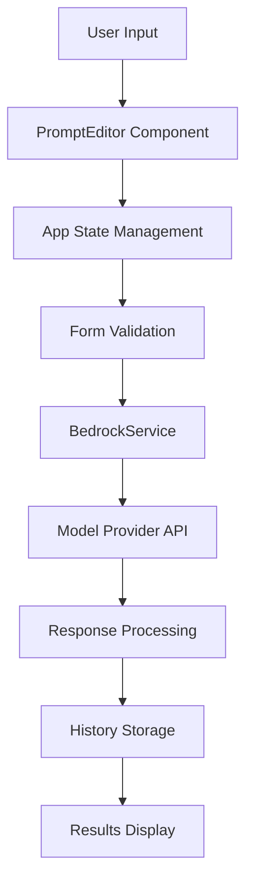

# Design Document

## Overview

This design document outlines the implementation of dual prompt input functionality for the Bedrock LLM analyzer. The feature will enhance the existing single prompt interface by separating system-level instructions from user queries, providing better control over model behavior and aligning with modern LLM interaction patterns.

The implementation will modify the existing PromptEditor component and update related services to handle both system and user prompts while maintaining backward compatibility with existing functionality.

## Architecture

### Component Architecture

The dual prompt functionality will be implemented through modifications to existing components rather than creating entirely new ones:

1. **PromptEditor Component Enhancement**: The existing `PromptEditor.jsx` will be refactored to support dual input fields
2. **App Component Updates**: The main `App.jsx` will be updated to handle dual prompt state management
3. **BedrockService Integration**: The `bedrockService.js` will be migrated to use AWS Bedrock Converse API for unified message handling
4. **History Service Updates**: The history functionality will be extended to store and retrieve both prompt types

### Key Architectural Benefits of Converse API

1. **Unified Interface**: Single API for all supported Bedrock models eliminates provider-specific code
2. **Native System Prompt Support**: Built-in system message handling across all compatible models
3. **Simplified Maintenance**: Reduced complexity in message formatting and response parsing
4. **Future Compatibility**: Automatic support for new models added to Converse API

### Data Flow



### State Management

The application will maintain separate state for system and user prompts:

```javascript
// New state structure in App.jsx
const [systemPrompt, setSystemPrompt] = useState('')
const [userPrompt, setUserPrompt] = useState('')
```

## Components and Interfaces

### Enhanced PromptEditor Component

The PromptEditor will be restructured to include:

1. **Dual Input Fields**:
   - System Prompt textarea with appropriate labeling and help text
   - User Prompt textarea with clear distinction from system prompt
   - Visual separation and consistent styling

2. **Template System Enhancement**:
   - System prompt templates (role definitions, behavior instructions)
   - User prompt templates (analysis, classification, etc.)
   - Template categories to distinguish between system and user templates

3. **Validation Integration**:
   - Real-time validation for both prompt types
   - Clear error messaging for missing required prompts
   - Visual indicators for validation state

4. **Preview Functionality**:
   - Combined preview showing how prompts will be sent to the model
   - Clear indication of message roles and formatting

### Updated App Component Interface

The main App component will be updated to:

1. **State Management**:
   - Separate state variables for system and user prompts
   - Updated validation logic to require both prompts
   - Enhanced form validation integration

2. **History Integration**:
   - Modified `handleLoadFromHistory` to restore both prompt types
   - Updated test result saving to include both prompts

3. **BedrockService Integration**:
   - Pass both prompts to the service layer
   - Handle proper message formatting for different providers

### BedrockService Enhancements

The BedrockService will be enhanced to:

1. **Converse API Integration**:
   - Migrate from direct model invocation to AWS Bedrock Converse API
   - Utilize standardized message format across all supported models
   - Leverage built-in system prompt support in Converse API

2. **Simplified Message Formatting**:
   - Use Converse API's unified message structure for all providers
   - System prompts handled natively by the API
   - Eliminate provider-specific formatting logic
   - Maintain backward compatibility with single prompt usage

3. **Enhanced Model Support**:
   - Automatic compatibility with all Converse API supported models
   - Consistent behavior across different model providers
   - Simplified error handling and response parsing

## Data Models

### Test Result Model Enhancement

The existing test result structure will be extended:

```javascript
{
  id: string,
  modelId: string,
  systemPrompt: string,    // New field
  userPrompt: string,      // Renamed from 'prompt'
  prompt: string,          // Deprecated but maintained for backward compatibility
  datasetType: string,
  datasetOption: string,
  response: string,
  usage: object,
  timestamp: string
}
```

### History Storage Model

The history storage will be updated to support both prompt types while maintaining backward compatibility:

```javascript
// New history record structure
{
  // ... existing fields
  systemPrompt: string,
  userPrompt: string,
  // Legacy 'prompt' field will be maintained for older records
}
```

### Validation Model

Enhanced validation structure:

```javascript
{
  systemPrompt: {
    required: true,
    minLength: 1,
    maxLength: 10000
  },
  userPrompt: {
    required: true,
    minLength: 1,
    maxLength: 10000
  }
}
```

## Error Handling

### Validation Errors

1. **Missing System Prompt**: Clear error message indicating system prompt is required
2. **Missing User Prompt**: Clear error message indicating user prompt is required
3. **Length Validation**: Appropriate warnings for prompts that are too long or too short
4. **Combined Length**: Warning if combined prompt length exceeds model limits

### Service Layer Errors

1. **Model Compatibility**: Handle cases where certain models don't support system prompts
2. **Formatting Errors**: Graceful fallback when prompt formatting fails
3. **API Errors**: Enhanced error messages that account for dual prompt structure

### User Experience Errors

1. **Migration Warnings**: Inform users when loading legacy single-prompt history entries
2. **Template Conflicts**: Handle cases where templates don't match the expected prompt type
3. **Copy/Paste Issues**: Validate and guide users when pasting content into wrong prompt fields

## Implementation Approach

### Development Strategy

The implementation will focus on:

1. **Incremental Enhancement**: Modify existing components rather than complete rewrites
2. **Backward Compatibility**: Ensure existing functionality continues to work
3. **User Experience**: Maintain intuitive interface while adding new capabilities
4. **API Modernization**: Leverage Converse API for simplified and more robust model interactions

## Migration Strategy

### Backward Compatibility

1. **Legacy Data Support**: Existing history entries with single prompts will be supported
2. **Graceful Degradation**: Single prompt entries will be treated as user prompts with empty system prompts
3. **Data Migration**: Optional migration utility to help users convert legacy prompts

### Rollout Plan

1. **Phase 1**: Implement dual prompt UI and validation
2. **Phase 2**: Update BedrockService and history functionality
3. **Phase 3**: Add template enhancements and migration utilities
4. **Phase 4**: Performance optimization and accessibility improvements

## Security Considerations

1. **Input Sanitization**: Both system and user prompts will be properly sanitized
2. **Length Limits**: Enforce reasonable limits to prevent abuse
3. **Content Validation**: Basic validation to prevent injection attempts
4. **Storage Security**: Secure storage of prompt history with appropriate access controls