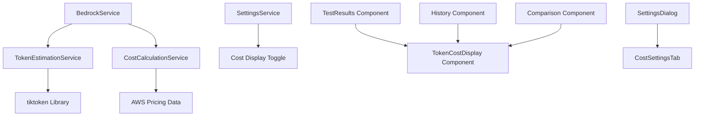

# Design Document

## Overview

The Enhanced Token and Cost Tracking feature extends the existing Bedrock LLM Analyzer with comprehensive token usage analysis and cost estimation capabilities. The design integrates seamlessly with the current architecture whig new services for token estimation and cost calculation. The system will provide detailed token breakdowns (input, output, tool tokens) and optional cost estimates based on AWS Bedrock pricing, with a user-configurable toggle to show or hide cost information.

## Architecture

### High-Level Architecture



### Service Layer Integration

The design follows the existing singleton service pattern established in the codebase:

- **TokenEstimationService**: Handles token counting when API doesn't provide usage data
- **CostCalculationService**: Manages cost calculations based on model-specific pricing
- **Enhanced BedrockService**: Extended to integrate token estimation and cost calculation
- **SettingsService**: Extended to include cost display preferences

### Data Flow

1. **Request Processing**: BedrockService processes model requests and captures API response
2. **Token Analysis**: If API provides usage data, use it; otherwise, estimate using TokenEstimationService
3. **Cost Calculation**: If cost display is enabled, CostCalculationService calculates estimates
4. **Result Enhancement**: Enhanced usage data (tokens + costs) is attached to test results
5. **UI Display**: Components conditionally display cost information based on user settings

## Components and Interfaces

### TokenEstimationService

```javascript
class TokenEstimationService {
  constructor() {
    this.encoders = new Map(); // Cache for tiktoken encoders
    this.isInitialized = false;
  }

  async initialize() {
    // Initialize tiktoken encoders for different model families
  }

  estimateTokens(text, modelId) {
    // Returns: { tokens: number, isEstimated: true }
  }

  getModelTokenizer(modelId) {
    // Maps model IDs to appropriate tokenizer
  }

  estimateInputTokens(systemPrompt, userPrompt, content) {
    // Estimates tokens for complete input
  }

  estimateOutputTokens(responseText) {
    // Estimates tokens for model response
  }
}
```

### CostCalculationService

```javascript
class CostCalculationService {
  constructor() {
    this.pricingData = new Map(); // Model pricing cache
    this.lastUpdated = null;
  }

  async initialize() {
    // Load AWS Bedrock pricing data
  }

  calculateCost(usage, modelId) {
    // Returns: {
    //   inputCost: number,
    //   outputCost: number,
    //   toolCost: number,
    //   totalCost: number,
    //   currency: 'USD',
    //   isEstimated: boolean
    // }
  }

  getModelPricing(modelId) {
    // Returns pricing structure for specific model
  }

  updatePricingData() {
    // Refreshes pricing data from AWS
  }
}
```

### Enhanced Usage Data Structure

```javascript
interface EnhancedUsage {
  // Token counts
  input_tokens: number;
  output_tokens: number;
  tool_tokens?: number;
  total_tokens: number;

  // Token metadata
  tokens_source: 'api' | 'estimated';
  estimation_method?: string;

  // Cost information (only when enabled)
  cost?: {
    input_cost: number;
    output_cost: number;
    tool_cost?: number;
    total_cost: number;
    currency: string;
    pricing_date: string;
    is_estimated: boolean;
  };
}
```

### TokenCostDisplay Component

```javascript
function TokenCostDisplay({ usage, showCost, compact = false }) {
  // Renders token and cost information
  // Adapts layout based on compact mode
  // Shows estimation indicators
  // Conditionally displays cost based on showCost prop
}
```

### CostSettingsTab Component

```javascript
function CostSettingsTab({ settings, onSettingsChange, onValidationChange }) {
  // Renders cost-related settings in SettingsDialog
  // Includes toggle for cost display
  // Shows pricing data source and last update
  // Provides cost calculation preferences
}
```

## Data Models

### Settings Extension

```javascript
// Addition to existing settings structure
const costSettings = {
  showCostEstimates: false,
  costCurrency: 'USD',
  includePricingDisclaimer: true,
  autoUpdatePricing: true,
  pricingDataSource: 'aws-bedrock',
  lastPricingUpdate: null
};
```

### Enhanced Test Result

```javascript
interface TestResult {
  // Existing fields...
  id: string;
  timestamp: Date;
  modelId: string;
  response: string;

  // Enhanced usage field
  usage: EnhancedUsage;

  // Additional metadata
  tokenEstimationMethod?: string;
  costCalculationVersion?: string;
}
```

### Pricing Data Structure

```javascript
interface ModelPricing {
  modelId: string;
  provider: string;
  inputTokenPrice: number;  // Price per 1000 tokens
  outputTokenPrice: number; // Price per 1000 tokens
  toolTokenPrice?: number;  // Price per 1000 tool tokens
  currency: string;
  effectiveDate: string;
  region: string;
  pricingTier: 'on-demand' | 'provisioned';
}
```

## Error Handling

### Token Estimation Errors

```javascript
// Graceful degradation when token estimation fails
const handleTokenEstimationError = (error, fallbackData) => {
  console.warn('Token estimation failed:', error);
  return {
    input_tokens: fallbackData?.input_tokens || null,
    output_tokens: fallbackData?.output_tokens || null,
    total_tokens: fallbackData?.total_tokens || null,
    tokens_source: 'unavailable',
    estimation_error: error.message
  };
};
```

### Cost Calculation Errors

```javascript
// Handle pricing data unavailability
const handleCostCalculationError = (error, modelId) => {
  console.warn(`Cost calculation failed for ${modelId}:`, error);
  return {
    cost: null,
    cost_error: 'Cost calculation unavailable',
    cost_error_reason: error.message
  };
};
```

### Network and Service Errors

- **Pricing Data Fetch Failures**: Cache last known pricing, show stale data warning
- **Token Estimation Library Errors**: Fall back to simple character-based estimation
- **Service Initialization Failures**: Disable features gracefully, show user notification

## Testing Strategy

### Unit Testing

```javascript
// TokenEstimationService tests
describe('TokenEstimationService', () => {
  test('estimates tokens for OpenAI-compatible models', async () => {
    const service = new TokenEstimationService();
    await service.initialize();

    const result = service.estimateTokens('Hello world', 'claude-3-sonnet');
    expect(result.tokens).toBeGreaterThan(0);
    expect(result.isEstimated).toBe(true);
  });

  test('handles unsupported models gracefully', () => {
    const service = new TokenEstimationService();
    const result = service.estimateTokens('Hello', 'unknown-model');
    expect(result.tokens).toBeNull();
    expect(result.error).toBeDefined();
  });
});

// CostCalculationService tests
describe('CostCalculationService', () => {
  test('calculates costs for known models', () => {
    const service = new CostCalculationService();
    const usage = { input_tokens: 100, output_tokens: 50 };

    const result = service.calculateCost(usage, 'claude-3-sonnet');
    expect(result.totalCost).toBeGreaterThan(0);
    expect(result.currency).toBe('USD');
  });
});
```

### Integration Testing

```javascript
// End-to-end token and cost tracking
describe('Enhanced Token Tracking Integration', () => {
  test('processes complete request with token estimation and cost calculation', async () => {
    const testRequest = {
      modelId: 'claude-3-sonnet',
      systemPrompt: 'You are a helpful assistant',
      userPrompt: 'Hello world',
      showCost: true
    };

    const result = await bedrockService.invokeModel(testRequest);

    expect(result.usage.input_tokens).toBeDefined();
    expect(result.usage.output_tokens).toBeDefined();
    expect(result.usage.tokens_source).toMatch(/api|estimated/);
    expect(result.usage.cost).toBeDefined();
    expect(result.usage.cost.totalCost).toBeGreaterThan(0);
  });
});
```

### Performance Testing

- **Token Estimation Speed**: Ensure < 100ms for typical prompts
- **Cost Calculation Speed**: Ensure < 10ms for standard calculations
- **Memory Usage**: Monitor tiktoken encoder memory footprint
- **UI Responsiveness**: Verify smooth toggle between cost display modes

## Implementation Considerations

### Token Estimation Library Selection

**Primary Choice: tiktoken (v1.0.22)**
- **Pros**: Official OpenAI tokenizer, accurate for GPT models, well-maintained
- **Cons**: May not be perfectly accurate for non-OpenAI models
- **Fallback**: js-tiktoken for pure JavaScript environments

**Model Mapping Strategy**:
```javascript
const MODEL_TOKENIZER_MAP = {
  // Claude models - use cl100k_base as approximation
  'anthropic.claude-3-sonnet': 'cl100k_base',
  'anthropic.claude-3-haiku': 'cl100k_base',

  // Nova models - use o200k_base for newer models
  'amazon.nova-pro': 'o200k_base',
  'amazon.nova-lite': 'o200k_base',

  // Llama models - use cl100k_base as approximation
  'meta.llama3-2-90b': 'cl100k_base',

  // Default fallback
  'default': 'cl100k_base'
};
```

### AWS Pricing Data Integration

**Pricing Data Source**: Static pricing data embedded in the application
- **Rationale**: AWS Bedrock pricing is relatively stable, avoiding API calls
- **Update Strategy**: Manual updates with new releases
- **Data Structure**: JSON file with model pricing by region

```javascript
// pricing-data.json
{
  "lastUpdated": "2025-01-15T00:00:00Z",
  "regions": {
    "us-east-1": {
      "models": {
        "anthropic.claude-3-sonnet-20240229-v1:0": {
          "inputPrice": 0.003,   // per 1K tokens
          "outputPrice": 0.015,  // per 1K tokens
          "currency": "USD"
        }
      }
    }
  }
}
```

### Performance Optimizations

**Token Estimation Caching**:
```javascript
class TokenEstimationService {
  constructor() {
    this.cache = new Map(); // LRU cache for token estimates
    this.maxCacheSize = 1000;
  }

  estimateTokens(text, modelId) {
    const cacheKey = `${modelId}:${this.hashText(text)}`;
    if (this.cache.has(cacheKey)) {
      return this.cache.get(cacheKey);
    }

    const result = this.performEstimation(text, modelId);
    this.cache.set(cacheKey, result);
    return result;
  }
}
```

**Lazy Loading**:
- Load tiktoken encoders only when needed
- Initialize cost calculation service on first use
- Defer pricing data loading until cost display is enabled

### User Experience Considerations

**Progressive Enhancement**:
1. **Basic**: Show token counts from API when available
2. **Enhanced**: Add token estimation for missing data
3. **Advanced**: Include cost calculations when enabled

**Visual Indicators**:
- **Exact tokens**: Green checkmark icon
- **Estimated tokens**: Orange tilde (~) icon
- **Unavailable tokens**: Gray dash (-)
- **Cost estimates**: Dollar sign ($) with disclaimer

**Settings Integration**:
- Add "Cost & Tokens" tab to existing SettingsDialog
- Maintain existing tab structure and styling patterns
- Include help tooltips for complex settings

### Backward Compatibility

**Existing Data Migration**:
- Enhance existing test results with new usage structure
- Preserve original usage data while adding new fields
- Handle missing fields gracefully in UI components

**API Compatibility**:
- Maintain existing BedrockService interface
- Add new methods without breaking existing functionality
- Ensure existing components continue to work without modification

### Security and Privacy

**Data Handling**:
- Token estimation performed locally (no external API calls)
- Pricing data embedded in application (no external dependencies)
- No sensitive data transmitted for cost calculations

**User Control**:
- Cost display completely optional and user-controlled
- Clear indication when features are disabled
- No cost calculations performed when feature is disabled
