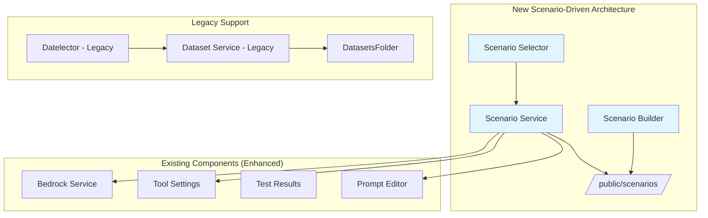

# Design Document

## Overview

This design document outlines the architecture for transforming the Bedrock LLM Analyzer from a dataset-driven system to a scenario-driven system. The new architecture will organize all functionality around comprehensive scenarios that encapsulate datasets, prompts, tools, and metadata in unified JSON configurations. This design ensures a streamlined user experience while maintaining backward compatibility and enabling rich scenario-specific functionality.

## Architecture

### High-Level Architecture Changes

The transformation involves several key architectural shifts:

1. **Configuration Centralization**: Moving from separate dataset + tool configurations to unified scenario files
2. **Dynamic UI Rendering**: UI components that adapt based on scenario capabilities
3. **Service Layer Refactoring**: New scenario service replacing dataset-specific services
4. **File System Organization**: New scenarios directory structure alongside existing datasets



### Scenario File Structure

Each scenario will be a self-contained JSON file with the following simplified structure:

```json
{
  "id": "fraud-detection-comprehensive",
  "name": "Fraud Detection - Comprehensive Analysis",
  "description": "Complete fraud detection scenario with multiple datasets, specialized prompts, and action tools",

  "datasets": [
    {
      "id": "retail-transactions",
      "name": "Retail Transaction Data",
      "description": "Sample retail transaction data for fraud analysis",
      "file": "retail-transactions.csv"
    },
    {
      "id": "international-transactions",
      "name": "International Transaction Data",
      "description": "Cross-border transaction data with higher risk profiles",
      "file": "international-transactions.csv"
    }
  ],

  "systemPrompts": [
    {
      "id": "fraud-analyst",
      "name": "Fraud Detection Analyst",
      "content": "You are an expert fraud detection analyst with 10+ years of experience in financial crime prevention. Analyze transaction data to identify suspicious patterns, unusual behaviors, and potential fraud indicators. Focus on velocity checks, geographic anomalies, and merchant risk factors."
    },
    {
      "id": "risk-manager",
      "name": "Risk Management Specialist",
      "content": "You are a risk management specialist focused on minimizing financial losses while maintaining customer experience. Evaluate transactions for risk levels and recommend appropriate actions based on established risk thresholds and business policies."
    }
  ],

  "userPrompts": [
    {
      "id": "analyze-transactions",
      "name": "Analyze for Fraud Patterns",
      "content": "Analyze the provided transaction data for potential fraud indicators. Look for unusual patterns in amounts, locations, timing, and merchant categories. Identify any transactions that warrant further investigation and explain your reasoning."
    },
    {
      "id": "risk-assessment",
      "name": "Perform Risk Assessment",
      "content": "Perform a comprehensive risk assessment of the transaction data. Calculate risk scores for each account and transaction. Identify high-risk accounts that may require enhanced monitoring or immediate action."
    }
  ],

  "tools": [
    {
      "name": "freeze_account",
      "description": "Freeze an account to prevent further transactions",
      "inputSchema": {
        "type": "object",
        "properties": {
          "account_id": {"type": "string", "pattern": "^A[0-9]{4}$"},
          "reason": {"type": "string", "minLength": 20},
          "severity": {"type": "string", "enum": ["low", "medium", "high", "critical"]}
        },
        "required": ["account_id", "reason", "severity"]
      }
    },
    {
      "name": "flag_suspicious_transaction",
      "description": "Flag individual transactions for review without freezing the entire account",
      "inputSchema": {
        "type": "object",
        "properties": {
          "transaction_id": {"type": "string", "pattern": "^T[0-9]{4}$"},
          "account_id": {"type": "string", "pattern": "^A[0-9]{4}$"},
          "risk_score": {"type": "number", "minimum": 0, "maximum": 100}
        },
        "required": ["transaction_id", "account_id", "risk_score"]
      },
      "handler": "mockFraudTools.flagTransaction"
    }
  ]
  },

  "configuration": {
    "allowCustomPrompts": true,
    "allowDatasetModification": false,
    "defaultStreamingEnabled": true,
    "maxIterations": 10,
    "recommendedModels": ["anthropic.claude-3-5-sonnet-20241022-v2:0", "amazon.nova-pro-v1:0"]
  },

  "examples": [
    {
      "name": "Basic Fraud Detection",
      "description": "Simple fraud detection analysis with account freezing",
      "systemPrompt": "fraud-analyst",
      "userPrompt": "analyze-transactions",
      "dataset": "retail-transactions",
      "expectedOutcome": "Identification of suspicious transactions and potential account actions"
    }
  ]
}
```

## Components and Interfaces

### 1. ScenarioService

The central service for managing scenario operations:

```javascript
export class ScenarioService {
  constructor() {
    this.scenarios = new Map()
    this.currentScenario = null
    this.isInitialized = false
  }

  // Core scenario management
  async initialize()
  async loadScenarios()
  async getScenario(scenarioId)
  async validateScenario(scenarioData)

  // Scenario discovery and metadata
  async scanScenariosDirectory()
  getScenarioList()
  getScenarioMetadata(scenarioId)

  // Configuration extraction
  getSystemPrompts(scenarioId)
  getUserPrompts(scenarioId)
  getDatasets(scenarioId)
  getToolConfiguration(scenarioId)

  // UI state management
  getUIConfiguration(scenarioId)
  shouldShowDatasetSelector(scenarioId)
  shouldShowToolSettings(scenarioId)
  getToolExecutionMode(scenarioId)
}
```

### 2. ScenarioSelector Component

Replaces the DatasetSelector with scenario-focused functionality:

```javascript
const ScenarioSelector = ({
  selectedScenario,
  onScenarioSelect,
  validationError
}) => {
  const [scenarios, setScenarios] = useState([])
  const [isLoading, setIsLoading] = useState(false)
  const [error, setError] = useState(null)

  // Load scenarios from disk on mount
  useEffect(() => {
    loadAvailableScenarios()
  }, [])

  const loadAvailableScenarios = async () => {
    // Scan /public/scenarios/ directory
    // Parse scenario metadata
    // Update scenarios list
  }

  return (
    <div className="card">
      <div className="flex items-center space-x-2 mb-4">
        <h3 className="text-lg font-semibold text-gray-900">Select Scenario</h3>
        <HelpTooltip content="Choose a pre-configured scenario that includes datasets, prompts, and tools for specific use cases." />
      </div>

      {/* Scenario selection dropdown */}
      {/* Scenario description display */}
      {/* Configuration summary */}
    </div>
  )
}
```

### 3. Dynamic UI Components

Components that adapt based on scenario configuration:

#### ConditionalDatasetSelector
```javascript
const ConditionalDatasetSelector = ({ scenario, selectedDataset, onDatasetSelect }) => {
  if (!scenario?.datasets || scenario.datasets.length === 0) {
    return null // Hide completely if no datasets
  }

  return (
    <DatasetSelector
      datasets={scenario.datasets}
      selectedDataset={selectedDataset}
      onDatasetSelect={onDatasetSelect}
    />
  )
}
```

#### ConditionalToolSettings
```javascript
const ConditionalToolSettings = ({ scenario, toolSettings, onToolSettingsChange }) => {
  const tools = scenario?.tools

  if (!tools || tools.length === 0) {
    return null // Hide if no tools
  }

  // Check if any tools have handlers (execution mode)
  const hasExecutionCapability = tools.some(tool => tool.handler)

  return (
    <ToolExecutionSettings
      showExecutionToggle={hasExecutionCapability}
      toolSettings={toolSettings}
      onSettingsChange={onToolSettingsChange}
      tools={tools}
    />
  )
}
```

### 4. ScenarioBuilder Component

Form-based interface for creating and editing scenarios:

```javascript
const ScenarioBuilder = ({ isOpen, onClose, editingScenario = null }) => {
  const [scenarioData, setScenarioData] = useState(defaultScenarioStructure)
  const [validationErrors, setValidationErrors] = useState({})
  const [isSaving, setIsSaving] = useState(false)

  return (
    <Dialog open={isOpen} onClose={onClose} className="scenario-builder-dialog">
      <div className="scenario-builder-content">
        {/* Metadata section */}
        <ScenarioMetadataForm data={scenarioData} onChange={setScenarioData} />

        {/* Datasets section */}
        <ScenarioDatasetsForm data={scenarioData.datasets} onChange={updateDatasets} />

        {/* Prompts section */}
        <ScenarioPromptsForm
          systemPrompts={scenarioData.systemPrompts}
          userPrompts={scenarioData.userPrompts}
          onChange={updatePrompts}
        />

        {/* Tools section */}
        <ScenarioToolsForm data={scenarioData.tools} onChange={updateTools} />

        {/* Configuration section */}
        <ScenarioConfigForm data={scenarioData.configuration} onChange={updateConfig} />

        {/* Actions */}
        <div className="scenario-builder-actions">
          <button onClick={handleSave} disabled={isSaving}>
            {isSaving ? 'Saving...' : 'Save Scenario'}
          </button>
          <button onClick={onClose}>Cancel</button>
        </div>
      </div>
    </Dialog>
  )
}
```

### 5. Scenario Conversion

Simple conversion of existing fraud detection dataset to scenario format:

```javascript
// Convert existing fraud-detection dataset to scenario
const convertFraudDetectionToScenario = () => {
  // Read existing fraud-detection dataset files
  // Read existing fraud-tools.json configuration
  // Create new scenario JSON file
  // Copy dataset files to scenario directory
}
```

## Data Models

### Scenario Data Model

```typescript
interface Scenario {
  id: string
  name: string
  description: string

  datasets?: Dataset[]
  systemPrompts?: SystemPrompt[]
  userPrompts?: UserPrompt[]
  tools?: Tool[]
  configuration?: ScenarioConfiguration
}

interface Dataset {
  id: string
  name: string
  description: string
  file: string
}

interface SystemPrompt {
  id: string
  name: string
  content: string
}

interface UserPrompt {
  id: string
  name: string
  content: string
}

interface Tool {
  name: string
  description: string
  inputSchema: object
  handler?: string
}

interface ScenarioConfiguration {
  allowCustomPrompts?: boolean
  allowDatasetModification?: boolean
  defaultStreamingEnabled?: boolean
  maxIterations?: number
  recommendedModels?: string[]
}
```

## Error Handling

### Scenario Loading Errors

1. **File Not Found**: Graceful fallback with error message
2. **Invalid JSON**: Parse error handling with specific line/column information
3. **Schema Validation**: Detailed validation errors with suggestions
4. **Missing Dependencies**: Clear messages about missing files or configurations

### Runtime Errors

1. **Tool Execution Failures**: Fallback to detection mode
2. **Dataset Loading Issues**: Skip problematic datasets, continue with available ones
3. **Prompt Validation**: Default prompt fallbacks
4. **Configuration Conflicts**: Automatic resolution with user notification

## Testing Strategy

### Unit Tests

1. **ScenarioService**: Test scenario loading, validation, and configuration extraction
2. **ScenarioSelector**: Test scenario selection and UI updates
3. **ScenarioBuilder**: Test form validation and scenario creation

### Integration Tests

1. **End-to-End Scenario Loading**: Test complete scenario loading and UI configuration
2. **Tool Integration**: Test tool execution and detection modes
3. **File System Operations**: Test scenario file reading and writing

### Manual Testing Scenarios

1. **Scenario Creation**: Create new scenarios using the builder
2. **UI Adaptation**: Verify UI shows/hides elements based on scenario capabilities
3. **Tool Functionality**: Test both execution and detection modes
4. **Error Handling**: Test various error conditions and recovery

## Performance Considerations

### Lazy Loading

- Load scenario metadata first for quick browsing
- Load full scenario content only when selected
- Cache frequently accessed scenarios
- Lazy load large datasets within scenarios

### Caching Strategy

```javascript
class ScenarioCache {
  constructor() {
    this.metadataCache = new Map()
    this.scenarioCache = new Map()
    this.maxCacheSize = 50
  }

  cacheScenarioMetadata(scenarios) {
    // Cache lightweight metadata for browsing
  }

  cacheScenario(scenarioId, scenarioData) {
    // Cache full scenario with LRU eviction
  }

  invalidateCache(scenarioId) {
    // Remove from cache when scenario is modified
  }
}
```

### File System Optimization

- Use efficient directory scanning
- Implement file watching for automatic updates
- Batch file operations when possible
- Optimize JSON parsing for large scenarios

## Security Considerations

### File System Access

- Restrict scenario access to designated directories
- Validate file paths to prevent directory traversal
- Sanitize user input in scenario builder
- Implement file size limits for scenarios

### Content Validation

- Validate all JSON input against schemas
- Sanitize HTML content in descriptions
- Validate tool definitions for security issues
- Implement content security policies

### Tool Execution Security

- Sandbox tool execution environments
- Validate tool parameters against schemas
- Implement execution timeouts
- Log all tool executions for audit trails

## Migration Plan

### Phase 1: Core Infrastructure
1. Create ScenarioService and basic scenario loading
2. Implement ScenarioSelector component
3. Add scenario file structure and validation
4. Create basic scenario examples

### Phase 2: UI Integration
1. Implement dynamic UI components
2. Update App.jsx to use scenarios
3. Add conditional rendering logic
4. Test scenario-based UI adaptation

### Phase 3: Advanced Features
1. Implement ScenarioBuilder interface
2. Convert existing fraud detection dataset to scenario format
3. Implement caching and performance optimizations
4. Add comprehensive error handling

### Phase 4: Polish and Testing
1. Add comprehensive test coverage
2. Implement security measures
3. Add documentation and examples
4. Performance optimization and bug fixes

## Backward Compatibility

### Legacy Dataset Support

The system will maintain support for existing datasets during the transition:

1. **Dual Mode Operation**: Support both scenarios and legacy datasets initially
2. **Manual Conversion**: Convert fraud detection dataset to scenario format as part of implementation
3. **Graceful Degradation**: Fall back to dataset mode if scenarios unavailable

### Configuration Preservation

- Preserve existing tool configurations during conversion
- Maintain test history and results
- Keep user preferences and settings
