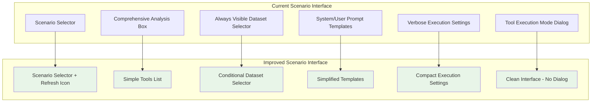

# Design Document

## Overview

This design document outlines the user experience improvements for the scenario-driven interface in the Bedrock LLM Analyzer. The design focuses on creating a cleaner, more intuitive interface by removing visual clutter, improving information hierarchy, and making the UI more responsive to scenario configurations. The improvements maintain all existing functionality while significantly enhancing usability.

## Architecture

### High-Level Design Changes

The UX improvements involve several key design changes:

1. **Information Display Simplification**: Replace verbose scenario metadata with minimal, focused information
2. **Dynamic UI Adaptation**: Enhanced conditional rendering based on scenario capabilities
3. **Layout Optimization**: More compact and efficient use of screen space
4. **Visual Hierarchy Improvements**: Better organization and grouping of related elements
5. **Template System Refinement**: Simplified labeling and improved content rendering



## Components and Interfaces

### 1. Enhanced ScenarioSelector Component

The ScenarioSelector will be modified to show minimal information and include seed data refresh functionality:

```javascript
const ScenarioSelector = ({
  selectedScenario,
  onScenarioSelect,
  validationError,
  onCreateScenario,
  onRefreshSeedData
}) => {
  const [scenarioMetadata, setScenarioMetadata] = useState(null)
  const [isRefreshingSeedData, setIsRefreshingSeedData] = useState(false)

  // Simplified metadata display - only show tools
  const renderScenarioInfo = () => {
    if (!scenarioMetadata || scenarioMetadata.hasError) return null

    return (
      <div className="mt-4 p-3 bg-gray-50 border border-gray-200 rounded-lg">
        <h4 className="text-sm font-medium text-gray-900 mb-2">
          {scenarioMetadata.name}
          {scenarioMetadata.hasSeedData && (
            <button
              onClick={handleRefreshSeedData}
              disabled={isRefreshingSeedData}
              className="ml-2 text-primary-600 hover:text-primary-700 disabled:opacity-50"
              title="Refresh seed data"
            >
              <svg className="w-4 h-4 inline" fill="none" stroke="currentColor" viewBox="0 0 24 24">
                <path strokeLinecap="round" strokeLinejoin="round" strokeWidth={2}
                      d="M4 4v5h.582m15.356 2A8.001 8.001 0 004.582 9m0 0H9m11 11v-5h-.581m0 0a8.003 8.003 0 01-15.357-2m15.357 2H15" />
              </svg>
            </button>
          )}
        </h4>

        {/* Only show tools if available */}
        {scenarioMetadata.hasTools && (
          <div className="space-y-2">
            <p className="text-xs text-gray-600 font-medium">Available Tools:</p>
            <ul className="text-xs text-gray-700 space-y-1">
              {scenarioMetadata.toolNames.map(toolName => (
                <li key={toolName} className="flex items-center space-x-2">
                  <span className="inline-block w-1.5 h-1.5 bg-green-400 rounded-full"></span>
                  <span>{toolName}</span>
                </li>
              ))}
            </ul>
          </div>
        )}
      </div>
    )
  }

  const handleRefreshSeedData = async () => {
    if (!selectedScenario || !onRefreshSeedData) return

    setIsRefreshingSeedData(true)
    try {
      await onRefreshSeedData(selectedScenario)
    } catch (error) {
      console.error('Failed to refresh seed data:', error)
    } finally {
      setIsRefreshingSeedData(false)
    }
  }

  return (
    <div className="card">
      {/* Scenario selection dropdown */}
      {/* Simplified scenario info display */}
      {renderScenarioInfo()}
    </div>
  )
}
```

### 2. Enhanced ConditionalDatasetSelector Component

The dataset selector will be truly conditional based on scenario configuration:

```javascript
const ConditionalDatasetSelector = ({
  scenario,
  selectedDataset,
  onDatasetSelect,
  validationError
}) => {
  const [scenarioConfig, setScenarioConfig] = useState(null)

  useEffect(() => {
    loadScenarioConfig()
  }, [scenario])

  const loadScenarioConfig = async () => {
    if (!scenario) {
      setScenarioConfig(null)
      return
    }

    try {
      const config = await scenarioService.getUIConfiguration(scenario)
      setScenarioConfig(config)
    } catch (error) {
      console.error('Failed to load scenario config:', error)
      setScenarioConfig(null)
    }
  }

  // Only render if scenario has datasets
  if (!scenarioConfig?.showDatasetSelector) {
    return null
  }

  return (
    <div className="card">
v className="flex items-center space-x-2 mb-4">
        <h3 className="text-lg font-semibold text-gray-900">Select Dataset</h3>
        <HelpTooltip content="Choose from the datasets configured for this scenario." />
      </div>

      {/* Dataset selection UI */}
      <DatasetSelector
        scenario={scenario}
        selectedDataset={selectedDataset}
        onDatasetSelect={onDatasetSelect}
        validationError={validationError}
      />
    </div>
  )
}
```

### 3. Simplified PromptEditor Component

The PromptEditor will use simplified template labels and proper newline rendering:

```javascript
const PromptEditor = ({
  systemPrompt,
  userPrompt,
  onSystemPromptChange,
  onUserPromptChange,
  systemPromptTemplates,
  userPromptTemplates,
  systemPromptError,
  userPromptError
}) => {
  const [activeTab, setActiveTab] = useState('system')

  const handleTemplateSelect = (template, isSystemPrompt) => {
    // Properly render newlines in template content
    const formattedContent = template.replace(/\\n/g, '\n')

    if (isSystemPrompt) {
      onSystemPromptChange(formattedContent)
    } else {
      onUserPromptChange(formattedContent)
    }
  }

  const renderTemplateSection = (templates, isSystemPrompt) => {
    if (!templates || templates.length === 0) return null

    return (
      <div className="mb-4">
        <div className="flex items-center space-x-2 mb-2">
          <span className="block text-sm font-medium text-gray-700">
            Templates
          </span>
          <HelpTooltip
            content={`${isSystemPrompt ? 'System' : 'User'} prompt templates provided by the selected scenario.`}
            position="right"
          />
        </div>
        <div className="flex flex-wrap gap-2">
          {templates.map((template) => (
            <button
              key={template.name}
              onClick={() => handleTemplateSelect(template.content, isSystemPrompt)}
              className="px-3 py-1 text-sm rounded-md transition-colors duration-200 bg-primary-100 hover:bg-primary-200 text-primary-700 border border-primary-300"
            >
              {template.name}
            </button>
          ))}
        </div>
      </div>
    )
  }

  return (
    <div className="card">
      <div className="flex items-center justify-between mb-4">
        <h3 className="text-lg font-semibold text-gray-900">Prompt Configuration</h3>
      </div>

      {/* Tab Navigation */}
      <div className="flex border-b border-gray-200 mb-4">
        <button
          onClick={() => setActiveTab('system')}
          className={`px-4 py-2 text-sm font-medium border-b-2 transition-colors duration-200 ${
            activeTab === 'system'
              ? 'border-primary-500 text-primary-600'
              : 'border-transparent text-gray-500 hover:text-gray-700'
          }`}
        >
          System Prompt
        </button>
        <button
          onClick={() => setActiveTab('user')}
          className={`px-4 py-2 text-sm font-medium border-b-2 transition-colors duration-200 ${
            activeTab === 'user'
              ? 'border-primary-500 text-primary-600'
              : 'border-transparent text-gray-500 hover:text-gray-700'
          }`}
        >
          User Prompt
        </button>
      </div>

      {/* System Prompt Tab */}
      {activeTab === 'system' && (
        <div className="space-y-4">
          {renderTemplateSection(systemPromptTemplates, true)}

          <div className="space-y-2">
            <label className="block text-sm font-medium text-gray-700">
              System Prompt <span className="text-gray-400 font-normal">(optional)</span>
            </label>
            <textarea
              value={systemPrompt}
              onChange={(e) => onSystemPromptChange(e.target.value)}
              className={`input-field resize-none ${
                systemPromptError ? 'border-red-300 focus:border-red-500 focus:ring-red-500' : ''
              }`}
              style={{ minHeight: '128px', whiteSpace: 'pre-wrap' }}
              placeholder="Optional: Define the AI's role and expertise..."
            />
            {systemPromptError && (
              <p className="text-sm text-red-600">{systemPromptError}</p>
            )}
          </div>
        </div>
      )}

      {/* User Prompt Tab */}
      {activeTab === 'user' && (
        <div className="space-y-4">
          {renderTemplateSection(userPromptTemplates, false)}

          <div className="space-y-2">
            <label className="block text-sm font-medium text-gray-700">
              User Prompt <span className="text-red-500">*</span>
            </label>
            <textarea
              value={userPrompt}
              onChange={(e) => onUserPromptChange(e.target.value)}
              className={`input-field resize-none ${
                userPromptError ? 'border-red-300 focus:border-red-500 focus:ring-red-500' : ''
              }`}
              style={{ minHeight: '128px', whiteSpace: 'pre-wrap' }}
              placeholder="Enter your specific request or question..."
              required
            />
            {userPromptError && (
              <p className="text-sm text-red-600">{userPromptError}</p>
            )}
          </div>
        </div>
      )}
    </div>
  )
}
```

### 4. Compact ConditionalExecutionSettings Component

The execution settings will be redesigned for more efficient space usage:

```javascript
const ConditionalExecutionSettings = ({
  scenario,
  useToolsEnabled,
  onUseToolsToggle,
  maxIterations,
  onMaxIterationsChange,
  determinismEnabled,
  onDeterminismToggle,
  streamingEnabled,
  onStreamingToggle,
  conflictMessage,
  showExecutionToggle,
  hasFormState,
  onClearSavedSettings
}) => {
  return (
    <div className="card">
      <div className="flex items-center space-x-2 mb-4">
        <h3 className="text-lg font-semibold text-gray-900">Execution Settings</h3>
        <HelpTooltip content="Configure how the AI model processes your requests." />
      </div>

      <div className="space-y-4">
        {/* Tool Execution Toggle - Only show if tools are available */}
        {showExecutionToggle && (
          <div className="flex items-center justify-between">
            <div className="flex items-center space-x-3">
              <svg className="w-5 h-5 text-primary-600" fill="none" stroke="currentColor" viewBox="0 0 24 24">
                <path strokeLinecap="round" strokeLinejoin="round" strokeWidth={2} d="M10.325 4.317c.426-1.756 2.924-1.756 3.35 0a1.724 1.724 0 002.573 1.066c1.543-.94 3.31.826 2.37 2.37a1.724 1.724 0 001.065 2.572c1.756.426 1.756 2.924 0 3.35a1.724 1.724 0 00-1.066 2.573c.94 1.543-.826 3.31-2.37 2.37a1.724 1.724 0 00-2.572 1.065c-.426 1.756-2.924 1.756-3.35 0a1.724 1.724 0 00-2.573-1.066c-1.543.94-3.31-.826-2.37-2.37a1.724 1.724 0 00-1.065-2.572c-1.756-.426-1.756-2.924 0-3.35a1.724 1.724 0 001.066-2.573c-.94-1.543.826-3.31 2.37-2.37.996.608 2.296.07 2.572-1.065z" />
                <path strokeLinecap="round" strokeLinejoin="round" strokeWidth={2} d="M15 12a3 3 0 11-6 0 3 3 0 016 0z" />
              </svg>
              <div>
                <h4 className="text-sm font-medium text-gray-900">Use Tools</h4>
                <p className="text-xs text-gray-500">Enable AI to execute tools and use results</p>
              </div>
            </div>
            <button
              onClick={() => onUseToolsToggle(!useToolsEnabled)}
              className={`relative inline-flex h-6 w-11 flex-shrink-0 cursor-pointer rounded-full border-2 border-transparent transition-colors duration-200 ease-in-out focus:outline-none focus:ring-2 focus:ring-primary-500 focus:ring-offset-2 ${
                useToolsEnabled ? "bg-primary-600" : "bg-gray-200"
              }`}
            >
              <span className={`pointer-events-none inline-block h-5 w-5 transform rounded-full bg-white shadow ring-0 transition duration-200 ease-in-out ${
                useToolsEnabled ? "translate-x-5" : "translate-x-0"
              }`} />
            </button>
          </div>
        )}

        {/* Compact Maximum Iterations - Only show if tools are enabled */}
        {useToolsEnabled && showExecutionToggle && (
          <div className="flex items-center justify-between">
            <div className="flex items-center space-x-2">
              <label className="text-sm font-medium text-gray-700">Max Iterations</label>
              <HelpTooltip content="Maximum number of tool execution rounds allowed" position="right" />
            </div>
            <div className="flex items-center space-x-2">
              <input
                type="number"
                min="1"
                max="50"
                value={maxIterations}
                onChange={(e) => onMaxIterationsChange(parseInt(e.target.value) || 1)}
                className="w-16 px-2 py-1 text-sm border border-gray-300 rounded-md focus:ring-primary-500 focus:border-primary-500"
              />
            </div>
          </div>
        )}

        {/* Determinism Evaluation Toggle */}
        <div className="flex items-center justify-between">
          <div className="flex items-center space-x-3">
            <svg className="w-5 h-5 text-primary-600" fill="none" stroke="currentColor" viewBox="0 0 24 24">
              <path strokeLinecap="round" strokeLinejoin="round" strokeWidth={2} d="M9 19v-6a2 2 0 00-2-2H5a2 2 0 00-2 2v6a2 2 0 002 2h2a2 2 0 002-2zm0 0V9a2 2 0 012-2h2a2 2 0 012 2v10m-6 0a2 2 0 002 2h2a2 2 0 002-2m0 0V5a2 2 0 012-2h2a2 2 0 012 2v14a2 2 0 01-2 2h-2a2 2 0 01-2-2z" />
            </svg>
            <div>
              <h4 className="text-sm font-medium text-gray-900">Determinism Evaluation</h4>
              <p className="text-xs text-gray-500">Run multiple tests to evaluate response consistency</p>
            </div>
          </div>
          <button
            onClick={() => onDeterminismToggle(!determinismEnabled)}
            disabled={useToolsEnabled}
            className={`relative inline-flex h-6 w-11 flex-shrink-0 cursor-pointer rounded-full border-2 border-transparent transition-colors duration-200 ease-in-out focus:outline-none focus:ring-2 focus:ring-primary-500 focus:ring-offset-2 disabled:opacity-50 disabled:cursor-not-allowed ${
              determinismEnabled && !useToolsEnabled ? "bg-primary-600" : "bg-gray-200"
            }`}
          >
            <span className={`pointer-events-none inline-block h-5 w-5 transform rounded-full bg-white shadow ring-0 transition duration-200 ease-in-out ${
              determinismEnabled && !useToolsEnabled ? "translate-x-5" : "translate-x-0"
            }`} />
          </button>
        </div>

        {/* Streaming Response Toggle */}
        <div className="flex items-center justify-between">
          <div className="flex items-center space-x-3">
            <svg className="w-5 h-5 text-primary-600" fill="none" stroke="currentColor" viewBox="0 0 24 24">
              <path strokeLinecap="round" strokeLinejoin="round" strokeWidth={2} d="M13 10V3L4 14h7v7l9-11h-7z" />
            </svg>
            <div>
              <h4 className="text-sm font-medium text-gray-900">Streaming Response</h4>
              <p className="text-xs text-gray-500">Show response as it's generated in real-time</p>
            </div>
          </div>
          <button
            onClick={() => onStreamingToggle(!streamingEnabled)}
            className={`relative inline-flex h-6 w-11 flex-shrink-0 cursor-pointer rounded-full border-2 border-transparent transition-colors duration-200 ease-in-out focus:outline-none focus:ring-2 focus:ring-primary-500 focus:ring-offset-2 ${
              streamingEnabled ? "bg-primary-600" : "bg-gray-200"
            }`}
          >
            <span className={`pointer-events-none inline-block h-5 w-5 transform rounded-full bg-white shadow ring-0 transition duration-200 ease-in-out ${
              streamingEnabled ? "translate-x-5" : "translate-x-0"
            }`} />
          </button>
        </div>

        {/* Conflict message - if any */}
        {conflictMessage && (
          <div className="bg-yellow-50 border border-yellow-200 rounded-lg p-3">
            <div className="flex items-center space-x-2">
              <svg className="h-5 w-5 text-yellow-600" fill="none" viewBox="0 0 24 24" stroke="currentColor">
                <path strokeLinecap="round" strokeLinejoin="round" strokeWidth={2} d="M12 9v2m0 4h.01m-6.938 4h13.856c1.54 0 2.502-1.667 1.732-2.5L13.732 4c-.77-.833-1.732-.833-2.5 0L4.268 15.5c-.77.833.192 2.5 1.732 2.5z" />
              </svg>
              <span className="text-sm text-yellow-800">{conflictMessage}</span>
            </div>
          </div>
        )}

        {/* Clear Saved Settings */}
        {hasFormState && (
          <div className="pt-4 border-t border-gray-200">
            <button
              onClick={onClearSavedSettings}
              className="flex items-center space-x-2 text-sm text-gray-600 hover:text-gray-800 transition-colors"
            >
              <svg className="w-4 h-4" fill="none" stroke="currentColor" viewBox="0 0 24 24">
                <path strokeLinecap="round" strokeLinejoin="round" strokeWidth={2} d="M19 7l-.867 12.142A2 2 0 0116.138 21H7.862a2 2 0 01-1.995-1.858L5 7m5 4v6m4-6v6m1-10V4a1 1 0 00-1-1h-4a1 1 0 00-1-1H8a1 1 0 00-1 1v3M4 7h16" />
              </svg>
              <span>Clear saved settings</span>
            </button>
          </div>
        )}
      </div>
    </div>
  )
}
```

## Data Models

### Enhanced Scenario Metadata Model

```typescript
interface ScenarioMetadata {
  id: string
  name: string
  description: string
  hasDatasets: boolean
  hasSystemPrompts: boolean
  hasUserPrompts: boolean
  hasTools: boolean
  hasSeedData: boolean
  toolNames: string[]
  datasetCount: number
  systemPromptCount: number
  userPromptCount: number
  toolCount: number
}

interface ScenarioUIConfiguration {
  showDatasetSelector: boolean
  showSystemPromptSelector: boolean
  showUserPromptSelector: boolean
  showToolSettings: boolean
  allowCustomPrompts: boolean
  allowDatasetModification: boolean
  defaultStreamingEnabled: boolean
  maxIterations: number
  recommendedModels: string[]
}
```

## Error Handling

### Graceful Degradation

1. **Missing Scenario Data**: Fall back to basic interface without scenario-specific features
2. **Template Rendering Errors**: Show raw template content if formatting fails
3. **Seed Data Refresh Failures**: Display error message but maintain current data
4. **Configuration Loading Errors**: Use default UI configuration

### User Feedback

1. **Loading States**: Show appropriate loading indicators for seed data refresh
2. **Success States**: Provide confirmation when seed data is refreshed
3. **Error States**: Clear error messages with actionable recovery options
4. **Validation States**: Real-time validation feedback for compact form elements

## Testing Strategy

### Visual Regression Testing

1. **Before/After Comparisons**: Ensure UI improvements don't break existing layouts
2. **Responsive Testing**: Verify compact layouts work across screen sizes
3. **Dynamic Content Testing**: Test show/hide behavior with different scenario configurations
4. **Template Rendering Testing**: Verify newline handling in various scenarios

### Functional Testing

1. **Scenario Selection Flow**: Test complete scenario selection and UI adaptation
2. **Template Selection**: Verify template content is properly formatted when selected
3. **Seed Data Refresh**: Test refresh functionality with various scenario types
4. **Conditional Rendering**: Test dataset selector visibility logic
5. **Compact Layout Functionality**: Ensure all controls remain functional in compact form

### Accessibility Testing

1. **Screen Reader Testing**: Verify simplified labels are properly announced
2. **Keyboard Navigation**: Test tab order with dynamic content
3. **Focus Management**: Ensure focus is handled correctly when elements show/hide
4. **Color Contrast**: Verify compact layouts maintain proper contrast ratios

## Performance Considerations

### Rendering Optimization

```javascript
// Memoize scenario metadata to prevent unnecessary re-renders
const scenarioMetadata = useMemo(() => {
  if (!selectedScenario) return null
  return scenarioService.getScenarioMetadata(selectedScenario)
}, [selectedScenario])

// Debounce seed data refresh to prevent rapid successive calls
const debouncedRefreshSeedData = useMemo(
  () => debounce(refreshSeedData, 1000),
  []
)
```

### Memory Management

- Cache scenario configurations to avoid repeated API calls
- Clean up event listeners when components unmount
- Use efficient data structures for template storage
- Implement lazy loading for large scenario lists

## Security Considerations

### Content Sanitization

- Sanitize template content before rendering to prevent XSS
- Validate scenario configuration data before applying UI changes
- Ensure seed data refresh operations are properly authenticated
- Implement rate limiting for refresh operations

### Data Validation

- Validate scenario metadata before displaying
- Ensure template content is properly escaped
- Verify UI configuration values are within expected ranges
- Implement proper error boundaries for component failures

## Migration Strategy

### Phase 1: Core UI Improvements
1. Implement simplified scenario information display
2. Update template labels and newline rendering
3. Create compact execution settings layout
4. Remove tool execution mode dialog

### Phase 2: Dynamic Behavior
1. Implement conditional dataset selector
2. Add seed data refresh functionality
3. Enhance scenario metadata handling
4. Update UI configuration logic

### Phase 3: Polish and Optimization
1. Implement responsive layout improvements
2. Add comprehensive error handling
3. Optimize performance and memory usage
4. Complete accessibility improvements

### Backward Compatibility

- Maintain all existing functionality during transition
- Ensure existing scenarios continue to work without modification
- Preserve user preferences and settings
- Provide fallback behavior for missing scenario features
