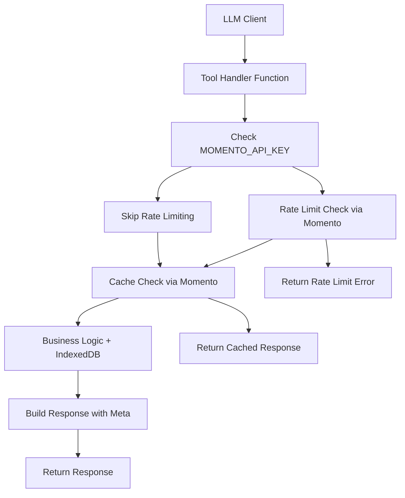

# Design Document

## Overview

This design document outlines a simple, straightforward approach for refactoring the shipping-logistics tools to meet enterprise standards. The design emphasizes simplicity, readability, and minimal abstractions to ensure the code is easy to understand and debug during livestreams or collaborative sessions.

## Architecture

### Simplified Architecture



### Simple Design Principles

- **Minimal Abstractions**: Only abstract error creation and rate limiting utilities
- **Inline Logic**: All caching, validation, and business logic done directly in each handler
- **Readable Code**: Code should be understandable in a livestream without digging through layers
- **No Cache Manager**: Cache operations done directly with Momento client in each handler
- **Straightforward Flow**: Linear execution path that's easy to follow and debug
- **Copy-Paste Friendly**: Common patterns can be easily copied between handlers

## Components and Interfaces

### 1. Tool Handler Structure

Each tool handler will follow this simple pattern:

```javascript Business Logic**: Preserves existing shipping logistics functionality
export async function toolName(parameters, context) {
  // 1. Basic parameter validation (inline)
  if (!parameters.order_id) {
    return createErrorResponse('/errors/validation', 'Missing order_id', 400,
      'The order_id parameter is required', 'Provide a valid order_id in the request');
  }

  // 2. Rate limiting (if Momento available)
  const rateLimitResult = await checkRateLimit();
  if (rateLimitResult.exceeded) {
    return createRateLimitError(rateLimitResult);
  }

  // 3. Cache check (if Momento available)
  const cacheKey = `shipping:${toolName}:${parameters.order_id}`;
  const cached = await checkCache(cacheKey, parameters.meta?.if_none_match);
  if (cached) {
    return cached; // 304 or cached response
  }

  // 4. Business logic (existing logic preserved)
  const businessResult = await executeBusinessLogic(parameters);

  // 5. Build response with meta
  const response = {
    ...businessResult,
    meta: {
      etag: generateEtag(businessResult),
      last_modified: new Date().toISOString(),
      from_cache: false,
      rate_limit: rateLimitResult.info,
      paging: { next_cursor: null, has_more: false },
      next_steps: "Response successfully retrieved"
    }
  };

  // 6. Cache the response (if Momento available)
  await cacheResponse(cacheKey, response);

  return response;
}
```

### 2. Simple Schema Definitions

#### Standard Request Meta (for write operations)
```javascript
const writeRequestMeta = {
  idempotency_key: "string", // required
  request_id: "string"       // required
};
```

#### Standard Request Meta (for read operations)
```javascript
const readRequestMeta = {
  if_none_match: "string|null",     // optional
  cache_control: "string|null",     // optional
  paging: {
    cursor: "string|null",          // optional
    limit: "number (1-100)"         // optional, default 20
  }
};
```

#### Standard Response Meta (all responses)
```javascript
const responseMeta = {
  etag: "string",                   // always present
  last_modified: "string",          // RFC3339 timestamp
  from_cache: "boolean",            // true if from cache
  rate_limit: {                     // null if no Momento
    limit: 100,
    remaining: "number",
    reset_seconds: "number"
  },
  paging: {
    next_cursor: "string|null",
    has_more: "boolean"
  },
  next_steps: "string"              // guidance text
};
```

### 3. Simple Error Responses

All errors follow RFC 7807 format with this simple structure:

```javascript
function createErrorResponse(type, title, status, detail, nextSteps) {
  return {
    type: type,                     // e.g., "/errors/validation"
    title: title,                   // e.g., "Validation Failed"
    status: status,                 // e.g., 400
    detail: detail,                 // detailed explanation
    instance: `/shipping/${toolName}/${Date.now()}`,
    next_steps: nextSteps           // actionable guidance
  };
}
```

### 4. Allowed Abstractions

#### Error Creation Utility
```javascript
function createErrorResponse(type, title, status, detail, nextSteps) {
  return {
    type: type,
    title: title,
    status: status,
    detail: detail,
    instance: `/shipping/${getCurrentToolName()}/${Date.now()}`,
    next_steps: nextSteps
  };
}

function createRateLimitError(rateLimitInfo) {
  return createErrorResponse(
    '/errors/rate_limit',
    'Rate Limit Exceeded',
    429,
    `Exceeded 100 requests per minute limit. Current: ${101 - rateLimitInfo.remaining}`,
    `Wait ${rateLimitInfo.reset_seconds} seconds before retrying`
  );
}
```

#### Rate Limiting Utility
```javascript
async function checkRateLimit() {
  if (!MOMENTO_ENABLED) {
    return { exceeded: false, info: null };
  }

  const key = `rate_limit:shipping:${getCurrentMinute()}`;
  const result = await momentoClient.increment('shipping-cache', key);

  const count = result.value || 0;
  const exceeded = count > 100;

  return {
    exceeded,
    info: {
      limit: 100,
      remaining: Math.max(0, 100 - count),
      reset_seconds: Math.ceil(60 - (Date.now() % 60000) / 1000)
    }
  };
}
```

### 5. Momento Integration (Inline in Each Handler)

Each handler will include this setup and use Momento directly:

```javascript
// At the top of each handler file
let momentoClient = null;
const MOMENTO_ENABLED = !!process.env.MOMENTO_API_KEY;

if (MOMENTO_ENABLED) {
  const { CacheClient } = await import('@gomomento/sdk-web');
  momentoClient = new CacheClient({
    configuration: CacheClient.Configurations.Laptop.v1(),
    credentialProvider: CredentialProvider.fromString({
      apiKey: process.env.MOMENTO_API_KEY
    }),
    defaultTtlSeconds: 300
  });
}

// Example handler showing inline cache operations
export async function getCarrierStatus(parameters, context) {
  // Rate limiting (abstracted utility)
  const rateLimitResult = await checkRateLimit();
  if (rateLimitResult.exceeded) {
    return createRateLimitError(rateLimitResult);
  }

  // Cache check (inline - no cache manager)
  if (MOMENTO_ENABLED) {
    const cacheKey = `shipping:carrier_status:${parameters.order_id}`;
    const result = await momentoClient.get('shipping-cache', cacheKey);
    if (result.value) {
      const cached = JSON.parse(result.value);
      if (parameters.meta?.if_none_match === cached.meta.etag) {
        return { status: 304, meta: cached.meta };
      }
      cached.meta.from_cache = true;
      return cached;
    }
  }

  // Business logic (preserved from existing implementation)
  const businessResult = await getCarrierDataFromStorage(parameters.order_id);

  // Build response with meta (inline)
  const response = {
    ...businessResult,
    meta: {
      etag: `"${Date.now()}-${JSON.stringify(businessResult).length}"`,
      last_modified: new Date().toISOString(),
      from_cache: false,
      rate_limit: rateLimitResult.info,
      paging: { next_cursor: null, has_more: false },
      next_steps: "Carrier status retrieved successfully"
    }
  };

  // Cache the response (inline - no cache manager)
  if (MOMENTO_ENABLED) {
    const cacheKey = `shipping:carrier_status:${parameters.order_id}`;
    await momentoClient.set('shipping-cache', cacheKey, JSON.stringify(response), 300);
  }

  return response;
}
```

```javascript
// Simple Momento client setup
let momentoClient = null;
const MOMENTO_ENABLED = !!process.env.MOMENTO_API_KEY;

if (MOMENTO_ENABLED) {
  const { CacheClient } = await import('@gomomento/sdk-web');
  momentoClient = new CacheClient({
    configuration: CacheClient.Configurations.Laptop.v1(),
    credentialProvider: CredentialProvider.fromString({
      apiKey: process.env.MOMENTO_API_KEY
    }),
    defaultTtlSeconds: 300
  });
}

// Simple rate limiting
async function checkRateLimit() {
  if (!MOMENTO_ENABLED) {
    return { exceeded: false, info: null };
  }

  const key = `rate_limit:shipping:${getCurrentMinute()}`;
  const result = await momentoClient.increment('shipping-cache', key);

  const count = result.value || 0;
  const exceeded = count > 100;

  return {
    exceeded,
    info: {
      limit: 100,
      remaining: Math.max(0, 100 - count),
      reset_seconds: 60 - (Date.now() % 60000) / 1000
    }
  };
}

// Simple caching
async function checkCache(key, ifNoneMatch) {
  if (!MOMENTO_ENABLED) {
    return null;
  }

  const result = await momentoClient.get('shipping-cache', key);
  if (!result.value) {
    return null;
  }

  const cached = JSON.parse(result.value);

  // Handle conditional requests
  if (ifNoneMatch && ifNoneMatch === cached.meta.etag) {
    return { status: 304, meta: cached.meta };
  }

  cached.meta.from_cache = true;
  return cached;
}
```

## Data Models

### Simple Tool Schemas

#### Get Carrier Status
```javascript
// Input
{
  order_id: "B456",           // required, pattern: ^[A-Z][0-9]{3,6}$
  meta: {                     // optional for read operations
    if_none_match: "etag123",
    cache_control: "max-age=300"
  }
}

// Output
{
  order_id: "B456",
  carrier: {
    name: "RegionalExpress",                    // enum: carriers
    tracking_number: "RX8829912847",           // pattern: ^[A-Z]{2}[0-9]{10}$
    status: "delivery_exception",              // enum: statuses
    exception_note: "Box felt warm to touch...",
    last_update: "2025-09-30T11:15:00Z",      // RFC3339
    attempts_remaining: 1                      // 0-3
  },
  meta: { /* standard response meta */ }
}
```

#### Expedite Shipment
```javascript
// Input
{
  order_id: "B456",                    // required
  speed: "overnight",                  // enum: ["overnight", "same_day"]
  reason: "Perishable goods at risk",  // 10-500 chars
  meta: {                              // required for write operations
    idempotency_key: "exp_b456_001",
    request_id: "req_123456"
  }
}

// Output
{
  success: true,
  action_id: "EXP_1696089600000_abc123",
  order_id: "B456",
  shipping_details: {
    new_tracking_number: "PA-OVN-PriorityAir-12345678",
    new_carrier: "PriorityAir",              // enum: expedite carriers
    new_eta: "2025-10-01T09:00:00Z",
    cost: {
      amount: 45.99,
      currency: "USD"                        // ISO-4217
    },
    temperature_controlled: true
  },
  confirmation: "Expedited overnight shipping confirmed",
  next_steps: [
    "Package will be picked up within 1 hour",
    "Customer will receive tracking update",
    "Temperature monitoring enabled"
  ],
  meta: { /* standard response meta */ }
}
```

## Error Handling

### Simple Error Types

1. **Validation Errors (400)**
```javascript
{
  type: "/errors/validation",
  title: "Request Validation Failed",
  status: 400,
  detail: "order_id must match pattern ^[A-Z][0-9]{3,6}$",
  instance: "/shipping/get_carrier_status/1696089600123",
  next_steps: "Provide order_id in format: one letter + 3-6 digits (e.g., B456)"
}
```

2. **Rate Limit Errors (429)**
```javascript
{
  type: "/errors/rate_limit",
  title: "Rate Limit Exceeded",
  status: 429,
  detail: "Exceeded 100 requests per minute limit",
  instance: "/shipping/expedite_shipment/1696089600456",
  next_steps: "Wait 42 seconds before retrying"
}
```

3. **Not Found Errors (404)**
```javascript
{
  type: "/errors/not_found",
  title: "Order Not Found",
  status: 404,
  detail: "Order B999 does not exist in the system",
  instance: "/shipping/get_carrier_status/1696089600789",
  next_steps: "Verify the order ID and ensure it exists in the system"
}
```

## Testing Strategy

### Simple Testing Approach

1. **Unit Tests**: Test each handler function directly with various inputs
2. **Mock Momento**: Simple mock that returns predictable responses
3. **Error Testing**: Test all error conditions with invalid inputs
4. **Integration Testing**: Test with real Momento when available

### Test Structure
```javascript
// Simple test example
test('getCarrierStatus returns valid response', async () => {
  const result = await getCarrierStatus({ order_id: 'B456' }, {});

  expect(result.order_id).toBe('B456');
  expect(result.carrier.name).toBeDefined();
  expect(result.meta.etag).toBeDefined();
  expect(result.meta.from_cache).toBe(false);
});
```

## Implementation Approach

### Phase 1: Update Schemas
1. Update each tool's input/output schema in scenario.json
2. Add proper validation patterns and enums
3. Document all fields with clear descriptions

### Phase 2: Refactor Handlers
1. Update each handler function to new format
2. Add inline rate limiting and caching
3. Preserve existing business logic
4. Add proper error responses

### Phase 3: Testing
1. Create simple test cases for each handler
2. Test with and without Momento
3. Verify error handling works correctly

### Phase 4: Documentation
1. Update tool descriptions
2. Add usage examples
3. Document error scenarios
