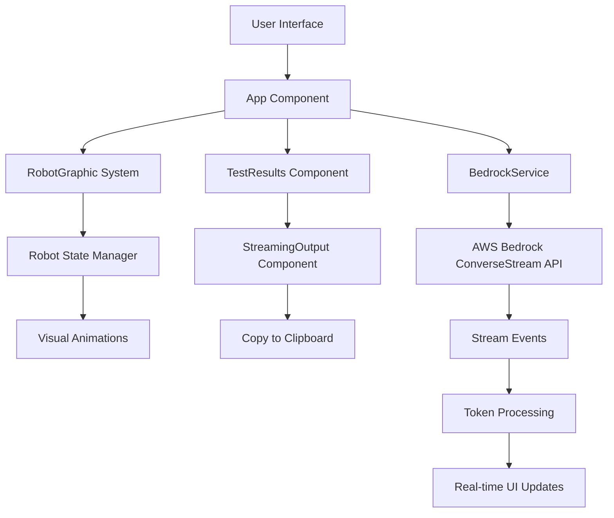

# Design Document

## Overview

This design implements real-time streaming capabilities for the Bedrock LLM Analyzer, allowing users to see AI responses appear token by token as they are generated. The solution integrates AWS Bedrock's ConverseStream API with the existing React application architecture, providing visual feedback through the robot graphic and convenient output management features.

The design maintains backward compatibility with the existing non-streaming implementation while adding progressive enhancement for supported models. The robot graphic will provide clear visual indicators of streaming activity, and users will have convenient access to copy generated content.

## Architecture

### High-Level Architecture



### Component Integration

The streaming functionality integrates with existing components:

1. **BedrockService**: Extended with streaming capabilities using ConverseStream API
2. **App Component**: Enhanced state management for streaming progress
3. **RobotGraphic**: New "talking" state during active streaming
4. **TestResults**: New streaming output display with copy functionality
5. **Robot State Management**: Enhanced state mapping for streaming scenarios

## Components and Interfaces

### Enhanced BedrockService

**New Methods:**
```javascript
// Stream-enabled model invocation
async invokeModelStream(modelId, systemPrompt, userPrompt, content, onToken, onComplete, onError)

// Check if model supports streaming
isStreamingSupported(modelId)

// Parse streaming events
parseStreamEvent(event)
```

**Streaming Event Types:**
- `messageStart`: Indicates response generation has begun
- `contentBlockDelta`: Contains individual tokens as they arrive
- `messageStop`: Indicates response completion with stop reason
- `metadata`: Contains usage statistics and performance metrics

### Streaming State Management

**New App State Properties:**
```javascript
{
  isStreaming: boolean,           // Currently receiving stream
  streamingContent: string,       // Accumulated streaming content
  streamingProgress: {            // Streaming progress info
    tokensReceived: number,
    estimatedTotal: number,
    startTime: number
  },
  streamingError: string | null   // Stream-specific errors
}
```

### Robot State Enhancements

**New Robot States:**
- `TALKING`: Active during token streaming with mouth movement animations
- `STREAMING_COMPLETE`: Brief state after successful stream completion

**Enhanced State Mapping:**
```javascript
// Streaming state detection
if (appState.isStreaming && appState.streamingContent) {
  return 'talking';
}
if (appState.testResults && !appState.isStreaming && wasStreaming) {
  return 'idle'; // Return to happy state after completion
}
```

### StreamingOutput Component

**New Component Features:**
```javascript
const StreamingOutput = ({
  content,
  isStreaming,
  isComplete,
  onCopy,
  streamingProgress
}) => {
  // Real-time content display
  // Copy to clipboard functionality
  // Streaming progress indicators
  // Accessibility announcements
}
```

## Data Models

### Streaming Response Model

```javascript
{
  id: string,                    // Unique response identifier
  modelId: string,              // Model used for generation
  systemPrompt: string,         // System prompt used
  userPrompt: string,           // User prompt used
  datasetType: string,          // Dataset type
  datasetOption: string,        // Dataset option
  response: string,             // Complete response text
  isStreamed: boolean,          // Whether response was streamed
  streamingMetrics: {           // Streaming performance data
    totalTokens: number,
    streamDuration: number,
    averageTokensPerSecond: number,
    firstTokenLatency: number
  },
  usage: {                      // Token usage information
    inputTokens: number,
    outputTokens: number,
    totalTokens: number
  },
  timestamp: string             // ISO timestamp
}
```

### Stream Event Model

```javascript
{
  type: 'messageStart' | 'contentBlockDelta' | 'messageStop' | 'metadata',
  data: {
    // Type-specific event data
    text?: string,              // For contentBlockDelta
    role?: string,              // For messageStart
    stopReason?: string,        // For messageStop
    usage?: object,             // For metadata
    metrics?: object            // For metadata
  },
  timestamp: number             // Event timestamp
}
```

## Error Handling

### Streaming Error Scenarios

1. **Stream Interruption**: Network issues during streaming
2. **Model Unavailable**: Selected model doesn't support streaming
3. **Rate Limiting**: AWS API rate limits exceeded
4. **Timeout**: Stream takes too long to complete

### Error Recovery Strategies

```javascript
// Graceful fallback to non-streaming
async invokeWithFallback(modelId, systemPrompt, userPrompt, content) {
  try {
    if (this.isStreamingSupported(modelId)) {
      return await this.invokeModelStream(...args);
    }
  } catch (streamError) {
    console.warn('Streaming failed, falling back to standard invoke:', streamError);
    return await this.invokeModel(...args);
  }
}
```

### User-Friendly Error Messages

- **Stream Interrupted**: "Connection interrupted. Showing partial response received."
- **Model Not Supported**: "This model doesn't support streaming. Using standard response mode."
- **Rate Limited**: "Too many requests. Please wait a moment and try again."

## Testing Strategy

### Unit Testing

1. **BedrockService Streaming Methods**
   - Mock ConverseStream API responses
   - Test event parsing and token accumulation
   - Verify error handling and fallback behavior

2. **Robot State Management**
   - Test streaming state transitions
   - Verify talking state activation during streaming
   - Test completion state handling

3. **StreamingOutput Component**
   - Test real-time content updates
   - Verify copy functionality
   - Test accessibility features

### Integration Testing

1. **End-to-End Streaming Flow**
   - Test complete streaming workflow
   - Verify robot state synchronization
   - Test error scenarios and recovery

2. **Cross-Model Compatibility**
   - Test streaming with different Bedrock models
   - Verify fallback for non-streaming models
   - Test performance across model types

### Accessibility Testing

1. **Screen Reader Compatibility**
   - Test live region announcements
   - Verify streaming status communication
   - Test keyboard navigation during streaming

2. **Motion Preferences**
   - Test reduced motion settings
   - Verify animation controls
   - Test static alternatives

## Implementation Phases

### Phase 1: Core Streaming Infrastructure
- Extend BedrockService with ConverseStream API
- Implement basic token streaming
- Add streaming state management to App component

### Phase 2: Robot Integration
- Add "talking" state to robot system
- Implement streaming state detection
- Add visual animations for streaming activity

### Phase 3: UI Enhancements
- Create StreamingOutput component
- Add copy to clipboard functionality
- Implement streaming progress indicators

### Phase 4: Error Handling & Accessibility
- Add comprehensive error handling
- Implement accessibility features
- Add performance monitoring

## Performance Considerations

### Streaming Optimization

1. **Token Batching**: Group rapid tokens to reduce UI updates
2. **Debounced Updates**: Prevent excessive re-renders during fast streaming
3. **Memory Management**: Clean up streaming state after completion

### UI Performance

```javascript
// Optimized streaming updates
const useStreamingContent = (tokens) => {
  const [content, setContent] = useState('');
  
  const debouncedUpdate = useMemo(
    () => debounce((newContent) => setContent(newContent), 50),
    []
  );
  
  useEffect(() => {
    debouncedUpdate(tokens.join(''));
  }, [tokens, debouncedUpdate]);
  
  return content;
};
```

### Network Optimization

- Connection pooling for streaming requests
- Retry logic for interrupted streams
- Bandwidth-aware streaming configuration

## Security Considerations

### Data Handling

- Secure token transmission over HTTPS
- No client-side storage of sensitive streaming data
- Proper cleanup of streaming buffers

### API Security

- Maintain existing AWS credential security
- Rate limiting awareness for streaming requests
- Proper error message sanitization

## Monitoring and Analytics

### Streaming Metrics

```javascript
{
  streamingMetrics: {
    totalStreams: number,
    successfulStreams: number,
    averageStreamDuration: number,
    averageTokensPerSecond: number,
    errorRate: number,
    fallbackRate: number
  }
}
```

### Performance Tracking

- First token latency measurement
- Stream completion rates
- Error categorization and frequency
- User interaction patterns with streaming content

## Browser Compatibility

### Streaming Support

- Modern browsers with EventSource/fetch streaming support
- Graceful degradation for older browsers
- Progressive enhancement approach

### Feature Detection

```javascript
const isStreamingSupported = () => {
  return (
    typeof ReadableStream !== 'undefined' &&
    typeof TextDecoder !== 'undefined' &&
    'body' in Request.prototype
  );
};
```