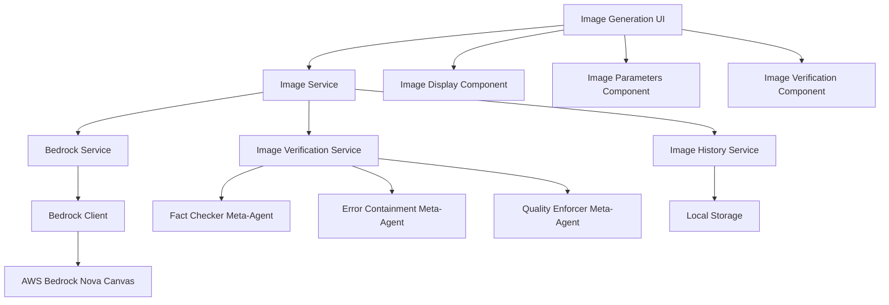

# Design Document

## Overview

The text-to-image generation feature extends Promptatron 3000 to support AWS Bedrock image generation models, specifically Amazon Nova Canvas. This feature integrates seamlessly with the existing architecture while adding specialized components for image generation, display, and meta-agent verification tailored for visual content.

The design leverages the existing meta-agent infrastructure (Fact Checker, Error Containment, Quality Enforcer) and adapts them for image content analysis, ensuring generated images meet quality, safety, and accuracy standards.

## Architecture

### High-Level Architecture



### Integration with Existing Architecture

The image generation feature integrates with existing Promptatron components:

- **BedrockService**: Extended to support image generation models and InvokeModel API for images
- **ModelSelector**: Enhanced to identify and display image-capable models
- **History**: Extended to store and display image generation results
- **MetaAgentService**: Adapted to handle image content verification
- **ScenarioService**: New image generation scenario added to scenarios manifest

## Components and Interfaces

### 1. Image Generation Service (`src/services/imageService.js`)

Primary service for handling image generation operations:

```javascript
class ImageService {
  constructor(bedrockService) {
    this.bedrockService = bedrockService;
    this.supportedModels = ['amazon.nova-canvas-v1:0'];
  }

  async generateImage(modelId, prompt, parameters = {}) {
    // Validate model supports image generation
    // Prepare image generation request
    // Invoke Bedrock model using InvokeModel API
    // Process and return image data
  }

  isImageGenerationModel(modelId) {
    return this.supportedModels.includes(modelId);
  }

  validateImagePrompt(prompt) {
    // Validate prompt length (max 1024 characters for Nova Canvas)
    // Check for basic content safety
    // Return validation result
  }

  parseImageResponse(response) {
    // Parse Bedrock image response
    // Extract base64 image data
    // Extract metadata (seed, dimensions, etc.)
    // Return structured result
  }
}
```

### 2. Image Verification Service (`src/services/imageVerificationService.js`)

Orchestrates meta-agent verification for generated images:

```javascript
class ImageVerificationService {
  constructor(metaAgentService) {
    this.metaAgentService = metaAgentService;
  }

  async verifyImage(imageData, originalPrompt, modelId) {
    const verificationTasks = [
      this.verifyContentSafety(imageData),
      this.verifyPromptAdherence(imageData, originalPrompt),
      this.verifyImageQuality(imageData)
    ];

    const results = await Promise.allSettled(verificationTasks);
    return this.consolidateVerificationResults(results);
  }

  async verifyContentSafety(imageData) {
    // Use Error Containment meta-agent
    // Check for inappropriate content, profanity, safety issues
  }

  async verifyPromptAdherence(imageData, originalPrompt) {
    // Use Fact Checker meta-agent
    // Verify image content matches prompt description
  }

  async verifyImageQuality(imageData) {
    // Use Quality Enforcer meta-agent
    // Assess technical and aesthetic quality
  }
}
```

### 3. Image Generation UI Components

#### ImageGenerationInterface (`src/components/ImageGenerationInterface.jsx`)

Main interface for image generation:

```javascript
const ImageGenerationInterface = ({ 
  selectedModel, 
  onImageGenerated, 
  isLoading, 
  error 
}) => {
  const [prompt, setPrompt] = useState('');
  const [parameters, setParameters] = useState({
    width: 512,
    height: 512,
    quality: 'standard',
    numberOfImages: 1
  });

  return (
    <div className="card">
      <div className="card-header">
        <h3>Image Generation</h3>
      </div>
      <div className="card-body space-y-4">
        <ImagePromptEditor 
          prompt={prompt}
          onPromptChange={setPrompt}
          maxLength={1024}
        />
        <ImageParametersPanel 
          parameters={parameters}
          onParametersChange={setParameters}
          modelId={selectedModel}
        />
        <ImageGenerationControls 
          onGenerate={() => handleGenerate(prompt, parameters)}
          isLoading={isLoading}
          disabled={!prompt.trim()}
        />
      </div>
    </div>
  );
};
```

#### ImageDisplay (`src/components/ImageDisplay.jsx`)

Component for displaying generated images with metadata:

```javascript
const ImageDisplay = ({ 
  imageResult, 
  verificationResults, 
  onRegenerate, 
  onSaveToHistory 
}) => {
  return (
    <div className="card">
      <div className="card-header">
        <h3>Generated Image</h3>
        <ImageActions 
          onRegenerate={onRegenerate}
          onSave={onSaveToHistory}
          onDownload={() => downloadImage(imageResult)}
        />
      </div>
      <div className="card-body">
        <div className="image-container">
          
        </div>
        <ImageMetadata 
          prompt={imageResult.prompt}
          model={imageResult.modelId}
          parameters={imageResult.parameters}
          generationTime={imageResult.generationTime}
        />
        <ImageVerificationResults 
          results={verificationResults}
        />
      </div>
    </div>
  );
};
```

#### ImageVerificationResults (`src/components/ImageVerificationResults.jsx`)

Displays meta-agent verification results:

```javascript
const ImageVerificationResults = ({ results }) => {
  const getVerificationIcon = (status) => {
    switch (status) {
      case 'accept': return <CheckCircleIcon className="text-green-500" />;
      case 'warning': return <ExclamationTriangleIcon className="text-yellow-500" />;
      case 'reject': return <XCircleIcon className="text-red-500" />;
      default: return <QuestionMarkCircleIcon className="text-gray-400" />;
    }
  };

  return (
    <div className="verification-results space-y-3">
      <h4 className="text-sm font-medium text-gray-900">Verification Results</h4>
      
      {results.contentSafety && (
        <VerificationCard
          title="Content Safety"
          icon={getVerificationIcon(results.contentSafety.recommendation)}
          confidence={results.contentSafety.confidence}
          analysis={results.contentSafety.analysis}
          details={results.contentSafety.safetyIssues}
        />
      )}
      
      {results.promptAdherence && (
        <VerificationCard
          title="Prompt Adherence"
          icon={getVerificationIcon(results.promptAdherence.recommendation)}
          confidence={results.promptAdherence.confidence}
          analysis={results.promptAdherence.analysis}
          details={results.promptAdherence.findings}
        />
      )}
      
      {results.imageQuality && (
        <VerificationCard
          title="Image Quality"
          icon={getVerificationIcon(results.imageQuality.recommendation)}
          confidence={results.imageQuality.confidence}
          analysis={results.imageQuality.analysis}
          details={results.imageQuality.qualityScore}
        />
      )}
    </div>
  );
};
```

### 4. Extended Bedrock Service

Extend existing BedrockService to support image generation:

```javascript
// Addition to existing BedrockService class
class BedrockService {
  // ... existing methods ...

  /**
   * Generate image using Bedrock image generation models
   */
  async generateImage(modelId, prompt, parameters = {}) {
    if (!this.clientManager.isReady()) {
      const initResult = await this.clientManager.initialize();
      if (!initResult.success) {
        throw new Error(initResult.message);
      }
    }

    const startTime = performance.now();

    try {
      // Prepare image generation request
      const requestBody = this.prepareImageGenerationRequest(prompt, parameters);
      
      const command = new InvokeModelCommand({
        modelId: modelId,
        body: JSON.stringify(requestBody),
        contentType: 'application/json',
        accept: 'application/json'
      });

      const response = await this.clientManager.runtimeClient.send(command);
      const responseBody = JSON.parse(new TextDecoder().decode(response.body));
      
      const endTime = performance.now();
      
      return this.parseImageGenerationResponse(responseBody, {
        modelId,
        prompt,
        parameters,
        generationTime: endTime - startTime
      });
    } catch (error) {
      throw new Error(`Image generation failed: ${error.message}`);
    }
  }

  prepareImageGenerationRequest(prompt, parameters) {
    return {
      taskType: "TEXT_IMAGE",
      textToImageParams: {
        text: prompt
      },
      imageGenerationConfig: {
        seed: parameters.seed || Math.floor(Math.random() * 858993460),
        quality: parameters.quality || "standard",
        width: parameters.width || 512,
        height: parameters.height || 512,
        numberOfImages: parameters.numberOfImages || 1
      }
    };
  }

  parseImageGenerationResponse(responseBody, metadata) {
    return {
      imageData: responseBody.images[0], // Base64 encoded image
      seed: responseBody.seed,
      prompt: metadata.prompt,
      modelId: metadata.modelId,
      parameters: metadata.parameters,
      generationTime: metadata.generationTime
    };
  }

  isImageGenerationModel(modelId) {
    const imageModels = ['amazon.nova-canvas-v1:0'];
    return imageModels.includes(modelId);
  }
}
```

## Data Models

### Image Generation Request

```javascript
{
  modelId: "amazon.nova-canvas-v1:0",
  prompt: "A stylized picture of a cute old steampunk robot",
  parameters: {
    width: 512,
    height: 512,
    quality: "standard",
    numberOfImages: 1,
    seed: 123456789
  }
}
```

### Image Generation Result

```javascript
{
  id: "img_gen_20241104_001",
  imageData: "base64EncodedImageString",
  prompt: "A stylized picture of a cute old steampunk robot",
  modelId: "amazon.nova-canvas-v1:0",
  parameters: {
    width: 512,
    height: 512,
    quality: "standard",
    seed: 123456789
  },
  generationTime: 3245.67,
  timestamp: "2024-11-04T10:30:00Z",
  verificationResults: {
    contentSafety: { /* meta-agent result */ },
    promptAdherence: { /* meta-agent result */ },
    imageQuality: { /* meta-agent result */ }
  }
}
```

### Image Verification Result

```javascript
{
  contentSafety: {
    recommendation: "accept|warning|reject",
    confidence: 95,
    analysis: "Image content is appropriate and safe for general audiences",
    safetyIssues: []
  },
  promptAdherence: {
    recommendation: "accept|warning|reject", 
    confidence: 88,
    analysis: "Image accurately depicts steampunk robot with good detail",
    findings: ["Robot design matches steampunk aesthetic", "Cute characteristics present"]
  },
  imageQuality: {
    recommendation: "accept|warning|reject",
    confidence: 92,
    analysis: "High quality image with good composition and detail",
    qualityScore: 87,
    breakdown: {
      technical: 22,
      composition: 21,
      detail: 23,
      aesthetics: 21
    }
  }
}
```

## Error Handling

### Image Generation Errors

- **Model Not Available**: Clear messaging when image models are unavailable
- **Prompt Validation**: Real-time validation with helpful suggestions
- **Generation Timeout**: Retry mechanisms with exponential backoff
- **Content Policy Violations**: Safe error handling with policy guidance
- **Network Issues**: Offline capability and retry logic

### Meta-Agent Verification Errors

- **Verification Timeout**: Graceful degradation with partial results
- **Meta-Agent Failures**: Fallback to basic safety checks
- **Analysis Errors**: Clear error reporting with retry options

## Testing Strategy

### Unit Tests

- **ImageService**: Test image generation request/response handling
- **ImageVerificationService**: Test meta-agent orchestration
- **Image Components**: Test UI interactions and state management
- **BedrockService Extensions**: Test image generation API integration

### Integration Tests

- **End-to-End Image Generation**: Full workflow from prompt to verified image
- **Meta-Agent Integration**: Verify image analysis pipeline
- **History Integration**: Test image storage and retrieval
- **Error Scenarios**: Test error handling and recovery

### Manual Testing Scenarios

1. **Basic Image Generation**: Simple prompts with default parameters
2. **Complex Prompts**: Detailed descriptions with multiple elements
3. **Parameter Variations**: Different sizes, quality settings, seeds
4. **Content Safety**: Prompts that should trigger safety warnings
5. **Quality Assessment**: Prompts designed to test quality scoring
6. **Error Conditions**: Network failures, invalid prompts, model unavailability

### Meta-Agent Adaptation for Images

#### Fact Checker Adaptation

```javascript
// Enhanced system prompt for image analysis
const imageFactCheckerPrompt = `You are a fact-checking specialist for image generation validation.

Your job is to verify that generated images accurately reflect the original text prompt.

Focus on:
- Visual elements mentioned in the prompt (objects, people, settings)
- Style and aesthetic requirements (artistic style, mood, composition)
- Technical specifications (if mentioned - colors, lighting, perspective)
- Logical consistency within the image
- Completeness of prompt requirements

Analyze the image and compare it to the original prompt to identify:
- Missing elements that were specifically requested
- Incorrect interpretations of the prompt
- Additional elements not requested that may detract from the prompt
- Overall accuracy of the visual representation

Provide specific findings about what matches and what doesn't match the prompt.`;
```

#### Error Containment Adaptation

```javascript
// Enhanced system prompt for image safety analysis
const imageErrorContainmentPrompt = `You are a content safety specialist for image generation validation.

Your job is to identify inappropriate, harmful, or policy-violating content in generated images.

Focus on:
- Inappropriate or explicit content
- Violence, weapons, or dangerous activities
- Hate symbols or discriminatory imagery
- Copyright or trademark violations
- Misleading or deceptive content
- Content that could be harmful to minors
- Professional or ethical violations

Analyze the image for safety concerns and provide specific safety issues if found.
Consider both obvious violations and subtle problematic content.`;
```

#### Quality Enforcer Adaptation

```javascript
// Enhanced system prompt for image quality analysis
const imageQualityEnforcerPrompt = `You are a quality assessment specialist for image generation validation.

Your job is to evaluate the technical and aesthetic quality of generated images.

Evaluate on these dimensions:
1. Technical Quality (25 points): Resolution, clarity, artifacts, distortion
2. Composition (25 points): Layout, balance, focal points, visual flow
3. Detail Level (25 points): Appropriate detail, texture, refinement
4. Aesthetic Appeal (25 points): Visual appeal, style consistency, artistic merit

Provide a quality score (0-100) and detailed breakdown explaining the assessment.
Consider the image type and intended use when evaluating quality standards.`;
```

## Performance Considerations

### Image Generation Optimization

- **Caching**: Cache model availability and parameters
- **Progressive Loading**: Show generation progress when possible
- **Batch Processing**: Support multiple image generation requests
- **Memory Management**: Efficient handling of base64 image data

### UI Performance

- **Lazy Loading**: Load images only when visible
- **Thumbnail Generation**: Create smaller previews for history
- **Virtual Scrolling**: Handle large image history efficiently
- **Image Compression**: Optimize display without losing quality

### Storage Optimization

- **Local Storage**: Efficient storage of image metadata
- **Image Compression**: Balance quality and storage size
- **Cleanup**: Automatic cleanup of old cached images
- **Export Options**: Allow users to save images externally

This design provides a comprehensive foundation for implementing text-to-image generation in Promptatron 3000 while maintaining consistency with existing architecture patterns and ensuring robust quality and safety verification through adapted meta-agents.