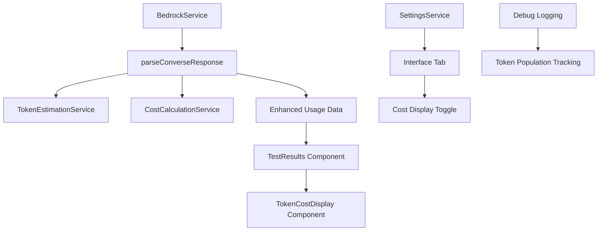

# Design Document

## Overview

The Token Display Improvements feature addresses critical issues in the enhanced token display system by fixing visual inconsistencies, resolving token usage population defects, and simping the cost settings interface. The design focuses on ensuring reliable data flow from API responses through to display components while maintaining visual consistency and providing a streamlined user experience.

## Architecture

### High-Level Architecture



### Data Flow Analysis

The current issue appears to be in the data flow from `BedrockService.parseConverseResponse()` to the `TestResults` component. The design will focus on:

1. **Reliable Token Data Population**: Ensuring `displayResults.usage` is consistently populated
2. **Visual Consistency**: Standardizing metric display styling
3. **Settings Simplification**: Consolidating cost settings into the Interface tab

## Components and Interfaces

### Enhanced BedrockService.parseConverseResponse()

```javascript
parseConverseResponse(response, modelId, systemPrompt, userPrompt, content) {
  // Extract API usage data
  const apiUsage = response.usage || null;

  // Get response text
  const text = response.output?.message?.content?.[0]?.text || 'No response generated';

  // Create enhanced usage data with debugging
  const usage = this.createEnhancedUsageData(apiUsage, text, modelId, systemPrompt, userPrompt, content);

  // Debug logging for troubleshooting
  console.log('BedrockService: parseConverseResponse - API usage:', apiUsage);
  console.log('BedrockService: parseConverseResponse - Enhanced usage:', usage);

  return { text, usage };
}

createEnhancedUsageData(apiUsage, responseText, modelId, systemPrompt, userPrompt, content) {
  const usage = {
    // Always populate basic structure
    input_tokens: null,
    output_tokens: null,
    total_tokens: null,
    tokens_source: 'unavailable',
    cost: null
  };

  try {
    // Step 1: Use API data if available
    if (apiUsage) {
      usage.input_tokens = apiUsage.inputTokens || null;
      usage.output_tokens = apiUsage.outputTokens || null;
      usage.total_tokens = apiUsage.totalTokens || null;
      usage.tokens_source = 'api';
      console.log('BedrockService: Using API token data:', usage);
    }

    // Step 2: Fall back to estimation if needed
    if (!usage.input_tokens || !usage.output_tokens) {
      const estimated = this.estimateTokenUsage(systemPrompt, userPrompt, content, responseText, modelId);
      if (estimated) {
        usage.input_tokens = usage.input_tokens || estimated.input_tokens;
        usage.output_tokens = usage.output_tokens || estimated.output_tokens;
        usage.total_tokens = usage.total_tokens || estimated.total_tokens;
        usage.tokens_source = apiUsage ? 'mixed' : 'estimated';
        console.log('BedrockService: Added estimated token data:', usage);
      }
    }

    // Step 3: Add cost calculation if enabled
    const costSettings = settingsService.getCostSettings();
    if (costSettings?.showCostEstimates && usage.input_tokens && usage.output_tokens) {
      usage.cost = costCalculationService.calculateCost(usage, modelId);
      console.log('BedrockService: Added cost data:', usage.cost);
    }

  } catch (error) {
    console.error('BedrockService: Error creating enhanced usage data:', error);
    // Return basic structure even on error
  }

  console.log('BedrockService: Final enhanced usage data:', usage);
  return usage;
}
```

### TokenCostDisplay Component Enhancement

```javascript
function TokenCostDisplay({ usage, showCost = false, compact = false }) {
  // Ensure usage data exists
  if (!usage) {
    console.warn('TokenCostDisplay: No usage data provided');
    return null;
  }

  const metrics = [
    {
      label: 'Input Tokens',
      value: usage.input_tokens,
      type: 'token'
    },
    {
      label: 'Output Tokens',
      value: usage.output_tokens,
      type: 'token'
    },
    {
      label: 'Total Tokens',
      value: usage.total_tokens,
      type: 'token'
    }
  ];

  // Add cost metrics if enabled
  if (showCost && usage.cost) {
    metrics.push(
      {
        label: 'Input Cost',
        value: usage.cost.input_cost,
        type: 'cost'
      },
      {
        label: 'Output Cost',
        value: usage.cost.output_cost,
        type: 'cost'
      },
      {
        label: 'Total Cost',
        value: usage.cost.total_cost,
        type: 'cost'
      }
    );
  }

  return (
    <div className="grid grid-cols-2 sm:grid-cols-4 gap-4">
      {metrics.map((metric, index) => (
        <MetricDisplay
          key={index}
          label={metric.label}
          value={metric.value}
          type={metric.type}
          source={usage.tokens_source}
        />
      ))}
    </div>
  );
}

function MetricDisplay({ label, value, type, source }) {
  const formatValue = (val, type) => {
    if (val === null || val === undefined) return 'N/A';

    if (type === 'cost') {
      return `$${val.toFixed(4)}`;
    }

    return val.toLocaleString();
  };

  const getSourceIndicator = () => {
    if (type === 'cost') return null;

    switch (source) {
      case 'api': return '✓';
      case 'estimated': return '~';
      case 'mixed': return '±';
      default: return '-';
    }
  };

  return (
    <div className="text-center">
      <div className="text-xs text-gray-500 mb-1 flex items-center justify-center space-x-1">
        <span>{label}</span>
        {getSourceIndicator() && (
          <span className="text-gray-400" title={`Source: ${source}`}>
            {getSourceIndicator()}
          </span>
        )}
      </div>
      <div className="text-lg font-semibold text-gray-900">
        {formatValue(value, type)}
      </div>
    </div>
  );
}
```

### TestResults Component Integration

```javascript
// In TestResults component, replace existing metrics display
const renderMetrics = () => {
  const baseMetrics = [
    { label: 'Characters', value: (displayOutput || displayResults.response)?.length || 0 },
    { label: 'Words', value: (displayOutput || displayResults.response)?.split(/\s+/).length || 0 },
    { label: 'Lines', value: (displayOutput || displayResults.response)?.split('\n').length || 0 }
  ];

  return (
    <div className="mt-4 pt-4 border-t border-gray-200">
      <h4 className="font-medium text-gray-700 mb-3">Metrics</h4>

      {/* Base metrics */}
      <div className="grid grid-cols-2 sm:grid-cols-4 gap-4 mb-4">
        {baseMetrics.map((metric, index) => (
          <div key={index} className="text-center">
            <div className="text-xs text-gray-500 mb-1">{metric.label}</div>
            <div className="text-lg font-semibold text-gray-900">
              {metric.value.toLocaleString()}
            </div>
          </div>
        ))}
      </div>

      {/* Token and cost metrics */}
      {displayResults.usage && (
        <TokenCostDisplay
          usage={displayResults.usage}
          showCost={showCost}
        />
      )}

      {/* Debug info in development */}
      {import.meta.env.DEV && (
        <div className="mt-2 text-xs text-gray-400">
          Debug: Usage source = {displayResults.usage?.tokens_source || 'none'}
        </div>
      )}
    </div>
  );
};
```

### Settings Interface Reorganization

```javascript
// Update SettingsDialog tab order
const tabs = [
  { id: 'interface', label: 'Interface' },  // Move to first position
  { id: 'determinism', label: 'Determinism' },
  { id: 'aws', label: 'AWS' },
  { id: 'storage', label: 'Storage' },
  { id: 'about', label: 'About' }
  // Remove 'cost' tab - integrate into interface
];

// Enhanced Interface Tab
function InterfaceSettingsTab({ onSettingsChange }) {
  const { settings: uiSettings, updateSettings: updateUISettings } = useUISettings();
  const { settings: costSettings, updateSettings: updateCostSettings } = useCostSettings();

  const handleCostToggle = async (enabled) => {
    await updateCostSettings({ showCostEstimates: enabled });
    onSettingsChange();
  };

  return (
    <div className="space-y-6">
      <div>
        <h3 className="text-lg font-semibold text-gray-900 mb-4">Interface Settings</h3>
        <p className="text-sm text-gray-600 mb-6">
          Customize the appearance and behavior of the user interface.
        </p>
      </div>

      {/* Existing UI settings */}
      <div className="grid grid-cols-1 md:grid-cols-2 gap-6">
        {/* Theme, animations, etc. */}
      </div>

      {/* Cost Display Section */}
      <div className="border-t border-gray-200 pt-6">
        <h4 className="text-md font-medium text-gray-900 mb-4">Cost Display</h4>

        <div className="space-y-4">
          <label className="flex items-start space-x-3">
            <input
              type="checkbox"
              checked={costSettings?.showCostEstimates || false}
              onChange={(e) => handleCostToggle(e.target.checked)}
              className="mt-1 rounded border-gray-300 text-primary-600 focus:ring-primary-500"
            />
            <div className="flex-1">
              <span className="text-sm font-medium text-gray-700">Show Cost Estimates</span>
              <p className="text-xs text-gray-500 mt-1">
                Display estimated costs for token usage based on AWS Bedrock pricing
              </p>
            </div>
          </label>

          {/* Cost accuracy warning */}
          {costSettings?.showCostEstimates && (
            <div className="ml-6 p-3 bg-yellow-50 border border-yellow-200 rounded-md">
              <div className="flex items-start space-x-2">
                <svg className="w-4 h-4 text-yellow-500 mt-0.5" fill="none" stroke="currentColor" viewBox="0 0 24 24">
                  <path strokeLinecap="round" strokeLinejoin="round" strokeWidth={2} d="M12 9v2m0 4h.01m-6.938 4h13.856c1.54 0 2.502-1.667 1.732-2.5L13.732 4c-.77-.833-1.964-.833-2.732 0L3.732 16.5c-.77.833.192 2.5 1.732 2.5z" />
                </svg>
                <div>
                  <p className="text-xs font-medium text-yellow-800">Cost Accuracy Notice</p>
                  <p className="text-xs text-yellow-700 mt-1">
                    Cost estimates are approximate and may vary from actual AWS billing.
                    Pricing data is updated at application startup.
                  </p>
                </div>
              </div>
            </div>
          )}
        </div>
      </div>
    </div>
  );
}
```

## Data Models

### Enhanced Usage Data Structure

```javascript
interface EnhancedUsage {
  // Token counts (always present, may be null)
  input_tokens: number | null;
  output_tokens: number | null;
  total_tokens: number | null;

  // Token metadata
  tokens_source: 'api' | 'estimated' | 'mixed' | 'unavailable';
  estimation_method?: string;

  // Cost information (only when enabled and tokens available)
  cost?: {
    input_cost: number;
    output_cost: number;
    total_cost: number;
    currency: string;
    is_estimated: boolean;
  } | null;
}
```

### Settings Structure Updates

```javascript
// Remove from costSettings
const removedCostSettings = {
  // showPricingDisclaimer: boolean - REMOVED
  // autoUpdatePricing: boolean - REMOVED
  // performanceImpactWarning: boolean - REMOVED
  // pricingDataInfo: object - REMOVED
};

// Keep in costSettings
const retainedCostSettings = {
  showCostEstimates: boolean,
  costCurrency: string,
  pricingDataSource: string,
  lastPricingUpdate: string
};
```

## Error Handling

### Token Population Debugging

```javascript
class TokenPopulationDebugger {
  static logTokenFlow(stage, data, context = {}) {
    if (!import.meta.env.DEV) return;

    console.group(`🔍 Token Flow - ${stage}`);
    console.log('Data:', data);
    console.log('Context:', context);
    console.log('Timestamp:', new Date().toISOString());
    console.groupEnd();
  }

  static validateUsageData(usage, source) {
    const issues = [];

    if (!usage) {
      issues.push('Usage data is null/undefined');
    } else {
      if (usage.input_tokens === null && usage.output_tokens === null) {
        issues.push('Both input and output tokens are null');
      }
      if (!usage.tokens_source) {
        issues.push('Missing tokens_source field');
      }
    }

    if (issues.length > 0) {
      console.warn(`Token validation issues at ${source}:`, issues);
    }

    return issues.length === 0;
  }
}
```

### Graceful Degradation

```javascript
const createFallbackUsageData = (modelId, systemPrompt, userPrompt, content, responseText) => {
  return {
    input_tokens: null,
    output_tokens: null,
    total_tokens: null,
    tokens_source: 'unavailable',
    cost: null,
    error: 'Token data unavailable',
    fallback_created: true,
    timestamp: new Date().toISOString()
  };
};
```

## Testing Strategy

### Token Population Testing

```javascript
describe('Token Population Flow', () => {
  test('API response with usage data', async () => {
    const mockResponse = {
      output: { message: { content: [{ text: 'Test response' }] } },
      usage: { inputTokens: 10, outputTokens: 20, totalTokens: 30 }
    };

    const result = bedrockService.parseConverseResponse(mockResponse, 'test-model');

    expect(result.usage.input_tokens).toBe(10);
    expect(result.usage.output_tokens).toBe(20);
    expect(result.usage.total_tokens).toBe(30);
    expect(result.usage.tokens_source).toBe('api');
  });

  test('API response without usage data falls back to estimation', async () => {
    const mockResponse = {
      output: { message: { content: [{ text: 'Test response' }] } },
      usage: null
    };

    const result = bedrockService.parseConverseResponse(mockResponse, 'test-model');

    expect(result.usage.tokens_source).toBe('estimated');
    expect(result.usage.input_tokens).toBeGreaterThan(0);
    expect(result.usage.output_tokens).toBeGreaterThan(0);
  });
});
```

### Visual Consistency Testing

```javascript
describe('TokenCostDisplay Visual Consistency', () => {
  test('renders with same styling as base metrics', () => {
    const usage = {
      input_tokens: 100,
      output_tokens: 50,
      total_tokens: 150,
      tokens_source: 'api'
    };

    const { container } = render(<TokenCostDisplay usage={usage} />);

    // Check for consistent grid layout
    expect(container.querySelector('.grid')).toHaveClass('grid-cols-2', 'sm:grid-cols-4', 'gap-4');

    // Check for consistent metric styling
    const metrics = container.querySelectorAll('.text-center');
    expect(metrics).toHaveLength(3);

    metrics.forEach(metric => {
      expect(metric.querySelector('.text-xs.text-gray-500')).toBeInTheDocument();
      expect(metric.querySelector('.text-lg.font-semibold.text-gray-900')).toBeInTheDocument();
    });
  });
});
```

## Implementation Considerations

### Performance Optimization

1. **Lazy Cost Calculation**: Only calculate costs when display is enabled
2. **Memoized Token Estimation**: Cache estimation results for identical inputs
3. **Efficient Settings Access**: Use hooks to minimize re-renders

### Backward Compatibility

1. **Graceful Fallbacks**: Handle missing usage data without breaking display
2. **Settings Migration**: Automatically migrate old cost settings to new structure
3. **Component Resilience**: Ensure components work with partial data

### User Experience

1. **Immediate Feedback**: Settings changes apply instantly
2. **Clear Visual Hierarchy**: Separate token metrics from cost metrics
3. **Helpful Indicators**: Show data source and accuracy information

### Debugging Support

1. **Development Logging**: Comprehensive logging in development mode
2. **Error Tracking**: Track and report token population failures
3. **Validation Checks**: Validate data at each step of the flow

## Migration Strategy

### Phase 1: Fix Token Population
1. Enhance `parseConverseResponse` with debugging
2. Add validation and fallback logic
3. Implement comprehensive logging

### Phase 2: Visual Consistency
1. Update `TokenCostDisplay` component styling
2. Integrate with `TestResults` metrics section
3. Ensure responsive design consistency

### Phase 3: Settings Simplification
1. Move cost toggle to Interface tab
2. Remove unnecessary settings options
3. Update tab order and organization

### Phase 4: Testing and Validation
1. Comprehensive testing of token flow
2. Visual regression testing
3. User acceptance testing
