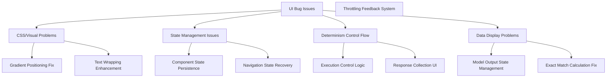
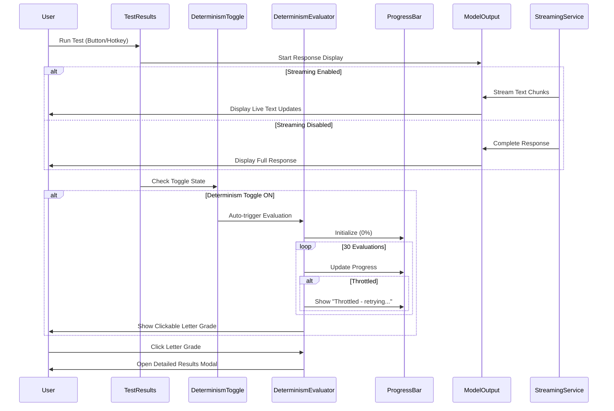

# Design Document

## Overview

This design addresses critical UI and functionality bugs in the Promptatron 3000 application through targeted fixes to CSS rendering, compont state management, determinism evaluation control flow, and data display logic. The solution focuses on surgical fixes that resolve specific issues without disrupting the existing architecture, ensuring reliable user experience and correct functionality.

## Architecture

### Problem Analysis and Solutions



### Component Interaction Flow



## Components and Interfaces

### 1. CSS and Visual Fixes

**Gradient Container Fix**:
```css
/* Fix for gradient positioning issues */
.gradient-container {
  position: relative;
  overflow: hidden;
  z-index: 1;
}

.gradient-overlay {
  position: absolute;
  top: 0;
  left: 0;
  right: 0;
  bottom: 0;
  pointer-events: none;
  z-index: 2;
}

/* Ensure gradients don't interfere with text */
.text-content {
  position: relative;
  z-index: 3;
}
```

**Text Wrapping Enhancement**:
```css
/* Enhanced text wrapping for system prompts */
.system-prompt-display {
  word-wrap: break-word;
  word-break: break-word;
  white-space: pre-wrap;
  overflow-wrap: anywhere;
  max-width: 100%;
  hyphens: auto;
}

.test-results-prompt {
  display: block;
  width: 100%;
  max-width: 100%;
  overflow: hidden;
  text-overflow: ellipsis;
  white-space: normal;
}
```

### 2. Determinism Evaluation Control with Auto-Trigger

**Auto-Trigger Control Interface**:
```typescript
interface DeterminismToggleState {
  isEnabled: boolean
  autoTriggerOnTest: boolean
}

interface DeterminismExecutionControl {
  isRunning: boolean
  progress: number // 0-100
  currentStep: number // 1-30
  totalSteps: number // 30
  status: 'idle' | 'running' | 'throttled' | 'completed' | 'failed'
  statusMessage: string
  executionId: string | null
  letterGrade: string | null
  isClickable: boolean
}

class DeterminismController {
  private executionState: Map<string, DeterminismExecutionControl>
  private toggleState: DeterminismToggleState

  shouldAutoTrigger(): boolean {
    return this.toggleState.isEnabled && this.toggleState.autoTriggerOnTest
  }

  async startEvaluation(testId: string): Promise<void> {
    const state = this.getExecutionState(testId)
    state.isRunning = true
    state.progress = 0
    state.currentStep = 0
    state.status = 'running'
    state.statusMessage = 'Starting determinism evaluation...'

    // Notify UI to show progress bar
    this.notifyProgressUpdate(testId, state)
  }

  updateProgress(testId: string, step: number, status: string, message: string): void {
    const state = this.getExecutionState(testId)
    state.currentStep = step
    state.progress = (step / state.totalSteps) * 100
    state.status = status
    state.statusMessage = message

    this.notifyProgressUpdate(testId, state)
  }

  completeEvaluation(testId: string, grade: string): void {
    const state = this.getExecutionState(testId)
    state.isRunning = false
    state.progress = 100
    state.status = 'completed'
    state.letterGrade = grade
    state.isClickable = true
    state.statusMessage = `Evaluation complete - Grade: ${grade}`

    this.notifyProgressUpdate(testId, state)
  }
}
```

**Throttling Feedback System**:
```typescript
interface ThrottlingInfo {
  throttleCount: number
  totalThrottleTime: number
  lastThrottleTime: Date | null
  isCurrentlyThrottled: boolean
  retryCount: number
  exceededRetryThreshold: boolean
  maxRetriesReached: boolean
}

interface EvaluationSummary {
  grade: string
  responseCount: number
  executionTime: number
  throttlingInfo: ThrottlingInfo
  hasThrottlingMessage: boolean
  throttlingIssues: string[]
}

class ThrottlingTracker {
  private static readonly MAX_RETRY_THRESHOLD = 10
  private static readonly EXCESSIVE_THROTTLE_THRESHOLD = 5

  trackThrottleEvent(duration: number): void
  trackRetryAttempt(): void
  isExcessiveThrottling(): boolean
  generateSummaryMessage(): string | null
  generateIssueMessages(): string[]
  reset(): void

  // Check if we should continue retrying or log as an issue
  shouldContinueRetrying(): boolean {
    return this.retryCount < ThrottlingTracker.MAX_RETRY_THRESHOLD
  }

  // Mark when we've exceeded reasonable retry limits
  markExcessiveThrottling(): void {
    this.exceededRetryThreshold = true
  }
}
```

### 3. Progress Bar and Status Display

**Progress Bar Component**:
```typescript
interface ProgressBarProps {
  progress: number // 0-100
  status: 'idle' | 'running' | 'throttled' | 'completed' | 'failed'
  statusMessage: string
  currentStep: number
  totalSteps: number
  letterGrade?: string
  onGradeClick?: () => void
}

const DeterminismProgressBar: React.FC<ProgressBarProps> = ({
  progress,
  status,
  statusMessage,
  currentStep,
  totalSteps,
  letterGrade,
  onGradeClick
}) => {
  const getStatusColor = () => {
    switch (status) {
      case 'running': return 'bg-blue-500'
      case 'throttled': return 'bg-yellow-500'
      case 'completed': return 'bg-green-500'
      case 'failed': return 'bg-red-500'
      default: return 'bg-gray-300'
    }
  }

  return (
    <div className="determinism-progress-container">
      <div className="progress-header">
        <span className="progress-label">Determinism Evaluation</span>
        <span className="progress-counter">{currentStep}/{totalSteps}</span>
      </div>

      <div className="progress-bar-container">
        <div className="progress-bar-background">
          <div
            className={`progress-bar-fill ${getStatusColor()}`}
            style={{ width: `${progress}%` }}
          />
        </div>
        <span className="progress-percentage">{Math.round(progress)}%</span>
      </div>

      <div className="progress-status">
        <span className={`status-message ${status}`}>{statusMessage}</span>
        {letterGrade && (
          <button
            className="letter-grade-button clickable"
            onClick={onGradeClick}
            title="Click to view detailed results"
          >
            Grade: {letterGrade}
          </button>
        )}
      </div>
    </div>
  )
}
```

**Response Collection and Display**:
```typescript
interface ResponsesTabProps {
  responses: EvaluationResponse[]
  isVisible: boolean
  onClose: () => void
  evaluationSummary: EvaluationSummary
}

interface EvaluationResponse {
  id: string
  responseNumber: number
  text: string
  timestamp: Date
  tokenCount?: number
  executionTime?: number
}

interface EvaluationSummary {
  grade: string
  exactMatchPercentage: number
  averageLength: number
  uniqueResponses: number
  totalResponses: number
  executionTime: number
  throttlingInfo: ThrottlingInfo
}

const DetailedResultsModal: React.FC<ResponsesTabProps> = ({
  responses,
  isVisible,
  onClose,
  evaluationSummary
}) => {
  const [activeTab, setActiveTab] = useState<'summary' | 'responses'>('summary')

  return (
    <div className={`detailed-results-modal ${isVisible ? 'visible' : 'hidden'}`}>
      <div className="modal-header">
        <h2>Determinism Evaluation Results - Grade: {evaluationSummary.grade}</h2>
        <button onClick={onClose} className="close-button">×</button>
      </div>

      <div className="modal-tabs">
        <button
          className={`tab ${activeTab === 'summary' ? 'active' : ''}`}
          onClick={() => setActiveTab('summary')}
        >
          Summary
        </button>
        <button
          className={`tab ${activeTab === 'responses' ? 'active' : ''}`}
          onClick={() => setActiveTab('responses')}
        >
          All Responses ({responses.length})
        </button>
      </div>

      <div className="modal-content">
        {activeTab === 'summary' && (
          <SummaryTab summary={evaluationSummary} />
        )}
        {activeTab === 'responses' && (
          <ResponsesTab responses={responses} />
        )}
      </div>
    </div>
  )
}
```

### 4. Model Output State Management with Streaming

**Streaming Output Interface**:
```typescript
interface StreamingState {
  isStreaming: boolean
  streamingEnabled: boolean
  currentChunk: string
  accumulatedText: string
  streamComplete: boolean
  streamError: string | null
}

interface ModelOutputState {
  currentOutput: string | null
  testId: string | null
  timestamp: Date | null
  isDisplaying: boolean
  lastError: string | null
  streaming: StreamingState
}

class ModelOutputManager {
  private state: ModelOutputState
  private stateHistory: Map<string, ModelOutputState>
  private streamingCallbacks: Set<(text: string) => void>

  initializeStreaming(testId: string, streamingEnabled: boolean): void {
    this.state = {
      currentOutput: '',
      testId,
      timestamp: new Date(),
      isDisplaying: true,
      lastError: null,
      streaming: {
        isStreaming: streamingEnabled,
        streamingEnabled,
        currentChunk: '',
        accumulatedText: '',
        streamComplete: false,
        streamError: null
      }
    }
  }

  appendStreamChunk(chunk: string): void {
    if (!this.state.streaming.isStreaming) return

    this.state.streaming.currentChunk = chunk
    this.state.streaming.accumulatedText += chunk
    this.state.currentOutput = this.state.streaming.accumulatedText

    // Notify all registered callbacks
    this.streamingCallbacks.forEach(callback => {
      callback(this.state.currentOutput)
    })
  }

  completeStream(): void {
    if (this.state.streaming.isStreaming) {
      this.state.streaming.isStreaming = false
      this.state.streaming.streamComplete = true
      this.stateHistory.set(this.state.testId, { ...this.state })
    }
  }

  registerStreamingCallback(callback: (text: string) => void): void {
    this.streamingCallbacks.add(callback)
  }

  unregisterStreamingCallback(callback: (text: string) => void): void {
    this.streamingCallbacks.delete(callback)
  }
}

class StreamingService {
  private outputManager: ModelOutputManager

  async startStreamingResponse(
    modelId: string,
    systemPrompt: string,
    userPrompt: string,
    content: string,
    streamingEnabled: boolean
  ): Promise<string> {
    const testId = generateTestId()
    this.outputManager.initializeStreaming(testId, streamingEnabled)

    if (streamingEnabled) {
      return this.handleStreamingResponse(modelId, systemPrompt, userPrompt, content)
    } else {
      return this.handleNonStreamingResponse(modelId, systemPrompt, userPrompt, content)
    }
  }

  private async handleStreamingResponse(
    modelId: string,
    systemPrompt: string,
    userPrompt: string,
    content: string
  ): Promise<string> {
    // Use AWS Bedrock streaming API
    const stream = await bedrockService.invokeModelStream(modelId, systemPrompt, userPrompt, content)

    let fullResponse = ''
    for await (const chunk of stream) {
      const text = this.extractTextFromChunk(chunk)
      if (text) {
        fullResponse += text
        this.outputManager.appendStreamChunk(text)
      }
    }

    this.outputManager.completeStream()
    return fullResponse
  }

  private async handleNonStreamingResponse(
    modelId: string,
    systemPrompt: string,
    userPrompt: string,
    content: string
  ): Promise<string> {
    const response = await bedrockService.invokeModel(modelId, systemPrompt, userPrompt, content)
    this.outputManager.appendStreamChunk(response.text)
    this.outputManager.completeStream()
    return response.text
  }
}
```

### 5. Exact Match Calculation Fix

**Corrected Calculation Logic**:
```typescript
interface ExactMatchCalculator {
  calculateExactMatches(responses: string[]): ExactMatchResult
}

interface ExactMatchResult {
  exactMatchPercentage: number
  totalResponses: number
  uniqueResponses: number
  matchGroups: MatchGroup[]
}

interface MatchGroup {
  responseText: string
  count: number
  percentage: number
}

class ExactMatchCalculator {
  calculateExactMatches(responses: string[]): ExactMatchResult {
    // Remove any duplicate references to initial response
    const evaluationResponses = this.filterEvaluationResponses(responses)

    // Group identical responses
    const responseGroups = new Map<string, number>()
    evaluationResponses.forEach(response => {
      const normalized = this.normalizeResponse(response)
      responseGroups.set(normalized, (responseGroups.get(normalized) || 0) + 1)
    })

    // Calculate exact match percentage
    const totalResponses = evaluationResponses.length
    const largestGroup = Math.max(...responseGroups.values())
    const exactMatchPercentage = totalResponses > 0 ? (largestGroup / totalResponses) * 100 : 0

    return {
      exactMatchPercentage: Math.round(exactMatchPercentage * 100) / 100,
      totalResponses,
      uniqueResponses: responseGroups.size,
      matchGroups: this.createMatchGroups(responseGroups, totalResponses)
    }
  }

  private filterEvaluationResponses(responses: string[]): string[] {
    // Ensure we only count the 30 evaluation responses, not the initial response
    return responses.slice(-30) // Take the last 30 responses
  }

  private normalizeResponse(response: string): string {
    // Normalize whitespace and trim for accurate comparison
    return response.trim().replace(/\s+/g, ' ')
  }
}
```

## Data Models

### UI State Models

```typescript
interface UIBugFixState {
  gradientFixes: {
    appliedFixes: string[]
    hasIssues: boolean
  }
  textWrapping: {
    systemPromptWrapped: boolean
    testResultsWrapped: boolean
  }
  determinismControl: {
    executionStates: Map<string, DeterminismExecutionControl>
    throttlingTrackers: Map<string, ThrottlingTracker>
  }
  modelOutput: {
    currentState: ModelOutputState
    stateHistory: Map<string, ModelOutputState>
  }
}
```

### Error Recovery Models

```typescript
interface UIErrorRecovery {
  errorType: 'gradient' | 'wrapping' | 'state' | 'display'
  component: string
  errorMessage: string
  recoveryAction: string
  timestamp: Date
  resolved: boolean
}

interface RecoveryStrategy {
  errorType: string
  fallbackCSS?: string
  fallbackComponent?: React.ComponentType
  retryLogic?: () => Promise<boolean>
  userMessage: string
}
```

## Error Handling

### Throttling and Retry Logic

```typescript
class ThrottlingRetryManager {
  private static readonly MAX_RETRIES = 10
  private static readonly BACKOFF_BASE = 1000 // 1 second
  private static readonly MAX_BACKOFF = 30000 // 30 seconds

  async executeWithRetry<T>(
    operation: () => Promise<T>,
    tracker: ThrottlingTracker
  ): Promise<T> {
    let lastError: Error | null = null

    for (let attempt = 0; attempt <= ThrottlingRetryManager.MAX_RETRIES; attempt++) {
      try {
        return await operation()
      } catch (error) {
        lastError = error

        if (this.isThrottlingError(error)) {
          tracker.trackThrottleEvent(0)
          tracker.trackRetryAttempt()

          if (!tracker.shouldContinueRetrying()) {
            tracker.markExcessiveThrottling()
            console.warn('Exceeded retry threshold for throttling, logging as issue')
            break
          }

          const backoffTime = Math.min(
            ThrottlingRetryManager.BACKOFF_BASE * Math.pow(2, attempt),
            ThrottlingRetryManager.MAX_BACKOFF
          )

          await this.delay(backoffTime)
          continue
        }

        // Non-throttling errors should not retry
        throw error
      }
    }

    // If we get here, we've exceeded retries
    throw new Error(`Operation failed after ${ThrottlingRetryManager.MAX_RETRIES} retries: ${lastError?.message}`)
  }

  private isThrottlingError(error: any): boolean {
    return error.name === 'ThrottlingException' ||
           error.code === 'TooManyRequestsException' ||
           error.message?.includes('throttl')
  }

  private delay(ms: number): Promise<void> {
    return new Promise(resolve => setTimeout(resolve, ms))
  }
}
```

### CSS Fallback Strategies

```css
/* Fallback styles for gradient issues */
.gradient-container.fallback {
  background: linear-gradient(135deg, #f0f9f0 0%, #e6f3d5 100%);
  background-attachment: fixed;
}

/* Fallback for text wrapping issues */
.text-content.fallback {
  display: block !important;
  width: 100% !important;
  overflow: hidden !important;
  text-overflow: ellipsis !important;
  white-space: nowrap !important;
}

.text-content.fallback.expanded {
  white-space: normal !important;
  height: auto !important;
}
```

### State Recovery Logic

```typescript
class UIStateRecovery {
  private recoveryStrategies: Map<string, RecoveryStrategy>

  handleUIError(error: UIErrorRecovery): Promise<boolean> {
    const strategy = this.recoveryStrategies.get(error.errorType)
    if (!strategy) return Promise.resolve(false)

    switch (error.errorType) {
      case 'gradient':
        return this.recoverGradientIssue(error, strategy)
      case 'wrapping':
        return this.recoverWrappingIssue(error, strategy)
      case 'state':
        return this.recoverStateIssue(error, strategy)
      case 'display':
        return this.recoverDisplayIssue(error, strategy)
      default:
        return Promise.resolve(false)
    }
  }

  private async recoverGradientIssue(error: UIErrorRecovery, strategy: RecoveryStrategy): Promise<boolean> {
    // Apply fallback CSS
    const element = document.querySelector(`.${error.component}`)
    if (element && strategy.fallbackCSS) {
      element.classList.add('fallback')
      return true
    }
    return false
  }
}
```

## Testing Strategy

### Visual Regression Tests

1. **Gradient Positioning Tests**
   - Test long system prompts with various lengths
   - Verify gradient boundaries don't interfere with text
   - Check responsive behavior across screen sizes

2. **Text Wrapping Tests**
   - Test system prompts with various lengths and special characters
   - Verify wrapping in test results pane
   - Check overflow handling

### Functional Tests

1. **Determinism Control Tests**
   - Verify single execution per button click
   - Test hotkey behavior
   - Verify no automatic retries

2. **State Persistence Tests**
   - Test navigation away and back
   - Verify model output persistence
   - Test page refresh behavior

3. **Calculation Accuracy Tests**
   - Test exact match calculation with known datasets
   - Verify exclusion of initial response from calculations
   - Test edge cases (all identical, all unique)

## Implementation Phases

### Phase 1: CSS and Visual Fixes
- Fix gradient positioning and containment
- Implement enhanced text wrapping
- Add fallback styles for error recovery

### Phase 2: Determinism Control Flow
- Implement execution control logic
- Add throttling feedback system
- Create responses viewing tab

### Phase 3: State Management Fixes
- Implement model output state persistence
- Add navigation state recovery
- Fix exact match calculation logic

### Phase 4: Error Handling and Recovery
- Add comprehensive error handling
- Implement fallback strategies
- Create user-friendly error messages

## Security Considerations

1. **State Management Security**
   - Sanitize stored state data
   - Prevent state injection attacks
   - Validate state restoration data

2. **CSS Injection Prevention**
   - Sanitize dynamic CSS classes
   - Validate fallback CSS application
   - Prevent style injection through user input

## Performance Considerations

1. **State Management Performance**
   - Limit state history size (last 50 tests)
   - Implement efficient state lookup
   - Clean up old state data automatically

2. **CSS Performance**
   - Use efficient CSS selectors
   - Minimize reflow and repaint operations
   - Optimize gradient rendering

3. **Memory Management**
   - Clean up event listeners on component unmount
   - Limit stored response data
   - Implement garbage collection for old states

## Monitoring and Validation

1. **Error Tracking**
   - Log UI errors with context
   - Track recovery success rates
   - Monitor performance impact

2. **User Experience Metrics**
   - Track navigation success rates
   - Monitor display consistency
   - Measure error recovery effectiveness

3. **Functional Validation**
   - Verify determinism execution control
   - Validate calculation accuracy
   - Monitor state persistence reliability
